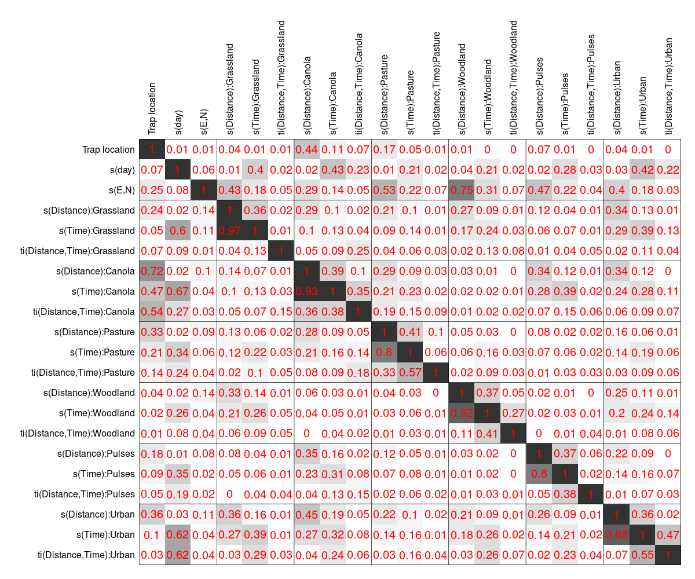
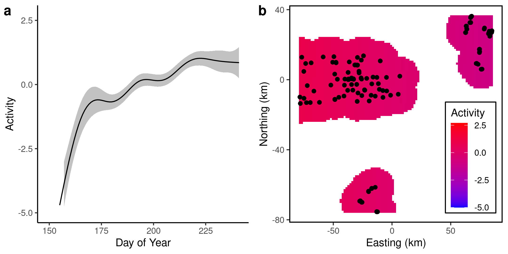

<!-- This argument in YAML header adds "manuscript_appendix.md" after document -->
<!-- output: -->
<!--   bookdown::html_document2: -->
<!--     pandoc_args: ["--include-after-body=manuscript_appendix.md"] -->

```{r setup, include=FALSE}
knitr::opts_chunk$set(echo = TRUE)
library(knitr)
library(tidyverse)
library(mgcv)
library(pander)

#Helper functions

#Capitalize
firstUpper <- function(x){
  paste0(toupper(substring(x,1,1)),substring(x,2,nchar(x)))
}

#Rounds to dig digits, converts to character, anything less than digits becomes "<0.xx1"
# Useful for tables
roundLess <- function(x,dig){
  x <- as.character(round(x,dig))
  x[x=='0'] <- paste0('<0.',strrep('0',dig-1),'1',collapse='')
  return(x)
}

boldRMD <- function(x) paste0('**',x,'**') #Makes text bold in rMarkdown
boldLaTeX <- function(x) paste0('\\textbf{',x,'}') #Makes text bold in LaTeX

#Load models
load('../data/PteMelMod.Rdata')
load('../data/ParDisMod.Rdata')
load('../data/ParMoeMod.Rdata')
load('../data/OpilioMod.Rdata')

#Get landscape % cover for each cover class
coverList <- PteMelMod$datList[9:25]
siteID <- as.numeric(rownames(unique(cbind(PteMelMod$datList$E,PteMelMod$datList$N))))
coverList <- lapply(coverList,function(x){
  data.frame(site=as.character(siteID),x[siteID,]) %>%  #Get unique sites only, convert to DF
  pivot_longer(cols=d30:d1500,names_to='dist',values_to='prop') %>% 
  mutate(dist=as.numeric(gsub('d','',dist)))
})
coverList <- data.frame(cover=rep(names(coverList),each=nrow(coverList[[1]])),do.call('rbind',coverList))

#Extract Pterostichus melanarius results
pmelRes <- summary(PteMelMod$mod3)
pmelLinTerms <- pmelRes$p.table %>% as.data.frame() %>% 
  rownames_to_column('loc') %>% 
  mutate(loc=firstUpper(gsub('trapLoc','',loc))) %>% 
  rename(p='Pr(>|z|)') %>% mutate(p=roundLess(p,3)) %>% 
  mutate(sig=is.na(as.numeric(p))|as.numeric(p)<0.05) %>% #If p<0.05
  mutate(pTable=ifelse(sig,boldLaTeX(p),p)) %>% select(-sig) #Make text bold
pmelSmTerms <- pmelRes$s.table %>% as.data.frame() %>% 
  rownames_to_column('Smoother') %>% 
  mutate(Smoother=gsub('distMat','Distance',Smoother),Smoother=gsub('endDayMat','Day',Smoother),Smoother=gsub('day','Day',Smoother)) %>% 
  rename(p='p-value') %>% mutate(p=roundLess(p,3)) %>% mutate_at(vars(2:4),roundLess,dig=2) %>% 
  mutate(sig=is.na(as.numeric(p))|as.numeric(p)<0.05) %>% #If p<0.05
  mutate(pTable=ifelse(sig,boldLaTeX(p),p)) %>% select(-sig) #Make text bold

#Extract Pardosa distincta results
pdisRes <- summary(ParDisMod$mod3)
pdisLinTerms <- pdisRes$p.table %>% as.data.frame() %>% 
  rownames_to_column('loc') %>% 
  mutate(loc=firstUpper(gsub('trapLoc','',loc))) %>% 
  rename(p='Pr(>|z|)') %>% mutate(p=roundLess(p,3)) %>% 
  mutate(sig=is.na(as.numeric(p))|as.numeric(p)<0.05) %>% #If p<0.05
  mutate(pTable=ifelse(sig,boldLaTeX(p),p)) %>% select(-sig) #Make text bold
pdisSmTerms <- pdisRes$s.table %>% as.data.frame() %>% 
  rownames_to_column('Smoother') %>% 
  mutate(Smoother=gsub('distMat','Distance',Smoother),Smoother=gsub('endDayMat','Day',Smoother),Smoother=gsub('day','Day',Smoother)) %>% 
  rename(p='p-value') %>% mutate(p=roundLess(p,3)) %>% mutate_at(vars(2:4),roundLess,dig=2) %>% 
  mutate(sig=is.na(as.numeric(p))|as.numeric(p)<0.05) %>% #If p<0.05
  mutate(pTable=ifelse(sig,boldLaTeX(p),p)) %>% select(-sig) #Make text bold

#Extract Pardosa moesta results
pmoeRes <- summary(ParMoeMod$mod3)
pmoeLinTerms <- pmoeRes$p.table %>% as.data.frame() %>% 
  rownames_to_column('loc') %>% 
  mutate(loc=firstUpper(gsub('trapLoc','',loc))) %>% 
  rename(p='Pr(>|z|)') %>% mutate(p=roundLess(p,3)) %>% 
  mutate(sig=is.na(as.numeric(p))|as.numeric(p)<0.05) %>% #If p<0.05
  mutate(pTable=ifelse(sig,boldLaTeX(p),p)) %>% select(-sig) #Make text bold
pmoeSmTerms <- pmoeRes$s.table %>% as.data.frame() %>% 
  rownames_to_column('Smoother') %>% 
  mutate(Smoother=gsub('distMat','Distance',Smoother),Smoother=gsub('endDayMat','Day',Smoother),Smoother=gsub('day','Day',Smoother)) %>% 
  rename(p='p-value') %>% mutate(p=roundLess(p,3)) %>% mutate_at(vars(2:4),roundLess,dig=2) %>% 
  mutate(sig=is.na(as.numeric(p))|as.numeric(p)<0.05) %>% #If p<0.05
  mutate(pTable=ifelse(sig,boldLaTeX(p),p)) %>% select(-sig) #Make text bold

#Extract Phalangium opilio results
opilRes <- summary(OpilioMod$mod3)
opilLinTerms <- opilRes$p.table %>% as.data.frame() %>% 
  rownames_to_column('loc') %>% 
  mutate(loc=firstUpper(gsub('trapLoc','',loc))) %>% 
  rename(p='Pr(>|z|)') %>% mutate(p=roundLess(p,3)) %>% 
  mutate(sig=is.na(as.numeric(p))|as.numeric(p)<0.05) %>% #If p<0.05
  mutate(pTable=ifelse(sig,boldLaTeX(p),p)) %>% select(-sig) #Make text bold
opilSmTerms <- opilRes$s.table %>% as.data.frame() %>% 
  rownames_to_column('Smoother') %>% 
  mutate(Smoother=gsub('distMat','Distance',Smoother),Smoother=gsub('endDayMat','Day',Smoother),Smoother=gsub('day','Day',Smoother)) %>% 
  rename(p='p-value') %>% mutate(p=roundLess(p,3)) %>% mutate_at(vars(2:4),roundLess,dig=2) %>% 
  mutate(sig=is.na(as.numeric(p))|as.numeric(p)<0.05) %>% #If p<0.05
  mutate(pTable=ifelse(sig,boldLaTeX(p),p)) %>% select(-sig) #Make text bold

# #Extract concurvity from PteMel model
# mod3concurv <- concurvity(PteMelMod$mod3,FALSE)$estimate

#Get variance components
varComp <- rownames_to_column(data.frame(gam.vcomp(PteMelMod$mod3),spp='Pterostichus melanarius'),'term') %>% 
  bind_rows(rownames_to_column(data.frame(gam.vcomp(ParDisMod$mod3),spp='Pardosa distincta'),'term')) %>% 
  bind_rows(rownames_to_column(data.frame(gam.vcomp(OpilioMod$mod3),spp='Phalangium opilio'),'term')) %>%
  mutate(term=factor(term,levels=names(PteMelMod$mod3$sp)))

```

# Introduction - needs flushing out

<!-- Ralph's "throwaway paragraph" -->
Arthropods are one of the most influential groups of animals in agricultural systems.
Pest arthropods can cause huge amounts of damage to crops, resulting in yield losses for farmers and negative downstream economic effects.
On the other hand, beneficial arthropods can deliver increased crop yields from extra pollination or free pest control.
The seasonal "pulses" of food resources from agricultural land act as a bottom-up driver of arthropod communities, which include both native and introduced species.
Agricultural land also constitutes 15 million km$^2$ (~36%) of land worldwide [@ramankutty2018], meaning that conservation of insect biodiversity should consider agricultural practices, as small changes in agricultural practices can have large effects globally.
In particular, land managers and conservationists are interested in finding "win-win" practices; that is, practices that result in better conservation outcomes while achieving the same (or higher) crop yields.

One method of passively manipulating agricultural arthropods is through landscape management [@albrecht2010; @landis2000; @martin2020].
Non-cultivated areas, such as natural or semi-natural land (SNL) can act as important habitat for some arthropods [@duelli2003].
Ground-nesting bees are generally driven by flower and nest availability [@roulston2011], and beetles can be limited by water, food, and egg-laying sites [@lovei1996; @gardiner2010].
However, while the effect of SNL on bees is generally positive, its effect on beetles and parasitoids less consistent [@macfadyen2013; @shackelford2013] 
Other organisms may use SNL as travel corridors or overwintering sites, but may not be directly dependent on them for reproduction.
Spillover from SNL occurs when organisms migrate from SNL into adjacent cropland, or from cropland into SNL [@tscharntke2005b]. 
The degree to which spillover occurs depends on the life history of the organism in question, as well as their reliance on the specific type of SNL.
Non-adjacent cropland can also influence arthropod abundance if the organisms are long-distance dispersers [@oberg2008].

<!-- Small patches of SNL can have a large effect if overall landscape lacks SNL (landscape contrast [@boetzl2020; @vanSchalkwyk2020]) -->
<!-- Limited understanding of other arthropods (but see ``beetle hedges" from UK?) -->
<!-- No-till agriculture is better for some ground beetles [@busch_Msc] -->
<!-- Arachnids are similarly limited by food, shelter -->

The effect of SNL on arthropod abundance also depends on the seasonal timing of emergence, feeding, and hibernation.
For this reason, it is important to consider the effect as being inherently spatio-temporal.
Arthropods move between landscape components depending on their life history.
e.g. Carabid beetles are thought to reproduce in field margins, but adults feed in fields [@desender1988].
This means that spillover depends not only on habitat type, but on time of the year.
Certain habitat types may be sources of arthropods during some times of the year, but sinks during other times.
<!-- Counts in pitfall traps are a proxy of activity density (not actual density), but this is probably an OK measure, at least within fields [@lang2000] -->

Our understanding of how landscape features influence beneficial arthropod abundance is incomplete.
The feeding and life-history characteristics of many predatory ground beetles and spiders is not well-documented, meaning that it is difficult to make generalizations of which types of habitat may increase their abundance.
Choosing the spatial scale of analysis depends on the characteristics of the organisms [@ahrenfeldt2015]; for example, bumblebee abundance can be controlled by both local- and landscape-wide SNL abundance [@westphal2006].
Finally, different SNL patches may act as sources or sinks of arthropods at different times of the year, but this is rarely considered [but see @desender1988].

In this study, we used pitfall traps to determine how landscape composition affects the seasonal activity density of arthropods across a prairie agroecosystem.
We hypothesized that:
1. Untilled semi-natural land (SNL) provides egg-laying and feeding areas for predatory arthropods, meaning that nearby SNL should act as a source of arthropods during the early part of the season, and a sink during the later part of the season. 
2. Crops in agricultural land act as sources of food for predatory arthropods during the growing season, while crop senescence at the end of the season causes a crash as pest popuations decrease. This should result in agricultural land becoming a sink for predators in the early part of the season as they migrate into the crop, and a source at the end of the season as they migrate out of the crop.
3. Crops may act as a temporary feeding site for predators, but do not act as permanent habitat. Therefore, crops may act as a local sink for arthropods, but will also be negatively associated at larger (landscape-level) scales.
Using a novel statistical technique, we were able to isolate seasonal signals of changes in arthropod abundance at multiple landscape scales.

# Methods

## Data collection

We used a system of pitfall traps installed at roadsides, field margins, wetlands, and in-field sites across southern Alberta in 2017 (_need a map here_).
Pitfall traps consisted of 582 mL Solo® cups buried up to the rim, partially filled with ethylene glycol.
All traps had 2 cm diameter wire mesh mounted over the rim to prevent vertebrates from falling into the traps.
Traps at roadsides were located 5m from the roads, while traps at in-field sites were installed 20, 100, 200m (?) along a transect from the nearest non-crop feature (wetland, grassland, pivot).
Specimens were collected from the traps every 14 days (SD: 2.9), and were identified to species.
  
We used three species of predatory arthropods that were present at very high abundances in the traps.
_Pterostichus melanarius_ is predatory introduced ground beetle that is a wide-ranging generalist [@carcamo1994; @larsen2003; @busch_Msc].
It is commonly found in untilled grasslands [@purtauf2005] and grassy field margins may act as larval habitat [@desender1988].
_Pardosa distincta_ is a species of wolf spider that is common across the Canadian prairies, and is commonly found in ungrazed pastures [@carcamo2014].
Finally, _Phallangium opilio_ is a widely-distributed generalist harvestman, whose habitat preferences are poorly understood. 
  
To characterize landscape composition surrounding the traps, we used classified landscape data from @AAFC_data.
<!-- + AAFC cropland landscape classifications are very accurate for cultivated fields (~90%), but are less accurate for non-crop areas (~70%) -->
We combined functionally similar landscape categories (cereals: _Triticum aestivum_ and _Hordeum vulgare_, pulses: _Pisum sativum_ and _Lens culinaris_, forest: coniferous and broadleaf), then extracted the landscape composition within a circle of a fixed radius surrounding each trap location. 
The ten most-common cover classes represented 98% of the total land cover in our study region: grassland, cereal, canola, pasture, pulses, wetland, urban, shrubland, flax, and forest (Figure \@ref(fig:landscapeComp)); flax was removed, as only a single site had nearby flax cover.
<!-- The radius of the circle necessary to characterize the landscape depends on the scale of the landscape that matters to a given organism [@addicott1987]. -->
At each site, we extracted the proportion of each landscape cover class within 30m annuli (rings), with inner radii ranging from 30 to 1470m, in increments of 30m.
Using functional regression [@ramsay2004], we were able to incorporate landscape information at different distance, allowing us to assess the impact of both local and regional landscape composition.

## Statistics

We used functional regression to model the effect of landscape composition on activity density.
Scalar-on-function (SoF) regression is a special type of functional regression model ($\hat{y}=X\beta$), where the columns of the model matrix $X$ contain some continuous predictor of the scalar $y$ (e.g. biomass in a plot (scalar) as a function of monthly average temperatures (vector)), and the values of the coefficients ($\beta$) are modeled as a smooth function $f(x)$ of the predictors.
In our case, each column represents the proportion of a given landscape cover class within each annulus, with increasing radii away from the location of the trap, and the coefficients are a smooth function of distance ($\beta_i = f(distance_i)$), meaning that the coefficients represent the (additive) effect of a given type of landscape cover at distances away from the trap.
This avoids the fundamental problem of choosing an optimal radius of landscape composition, and allows the possibility that the size of the landscape ``grain" relevant to a given organism may change over the course of its life stages [@addicott1987; @lima1996; @gardiner2010].
It also allows for the possibility that certain land cover types may be locally beneficial, but detremental at wider scales, indicating that the cover type may not constitute a completely useable habitat.
This technique has been used by other authors [@yen2014; @galpern2020].
  
Activity density of each arthropod was fit as generalized additive models @wood2017, using _mgcv_ version `r packageVersion('mgcv')`. 
Count data of arthropods were fit using a negative binomial distribution with a log-link.
To account for different lengths of trap exposure, log-days since trap placement was used as a fixed effect with its slope held at 1 ("offset" variable).
We included day of year as a 1-dimensional smooth and easting and northing as a 2-dimensional smooth, in order to account for underlying spatial and temporal autocorrelation in the data.
The deviance residuals from each model were visually inspected for normality and equal variance.

For each landscape term, we used three SoF regression terms:
First, we used the proportion cover of all landscape cover classes in the annuli surrounding each trap location (spatial effect of cover class).
Second, we used day of the year multiplied by the proportion of cover classes in each annuli (temporal effect of cover class). 
Finally, we used a tensor-product interaction of landscape cover and day of year (spatio-temporal interaction of cover class).
We used 10 basis dimensions for the spatial and temporal landscape smoothers, and 16 basis dimensions for the spatio-temporal interaction.
This was deemed adequate, as the effective degrees of freedom for all smoothing terms were far below the number of basis dimensions, indicating that no additional basis dimensions were needed (see Tables \@ref(tab:PteMelSmooth), \@ref(tab:ParDisSmooth), \@ref(tab:ParMoeSmooth), \@ref(tab:OpilioSmooth)).
To remove unimportant terms from the model, we used thin-plate regression splines with shrinkage ("bs=`ts'" in _mgcv_).
This is a continuous analog to stepwise model selection, whereby weaker terms can be completely removed from the model rather than reduced to a line [@marra2011].
<!-- + Double-penalization gave qualitatively similar results, but required twice the number of penalty terms, and some of the penalty terms were unstable  -->

Some of the landscape terms in our model were strongly concurved, so we removed them from the model or combined them.
Concurvity is a nonlinear analogue of multicollinearity, and can bias estimates of standard errors [@buja1989].
There is no agreed-upon threshold of "unacceptable" concurvity, but 0.5 is commonly used [@dominici2002; @ramsay2003]. 
Some landscape terms were strongly concurved (Figure \@ref(fig:concurvityFull)), namely forest and shrubland (max: 0.71), canola and cereal (max: 0.74), and grassland and wetland (max: 0.63).
Forest and shrubland were combined into the ``Tree/Shrub" category, grassland and wetland were combined into the "Grass/Wetland" category, as they were strongly positively correlated at all distances, indicating similar feature classes.
Cereal was removed from the model, as it was negatively correlated with canola cover at distances less than 200m and was positively correlated at distances over 500m, reflecting the most common crop rotations (canola $\rightarrow$ wheat $\rightarrow$ barley) and the commonly-used block structure (quarter-sections) present across our study region.
This resulted in a reduced set of landscape terms, none of which were strongly concurved with each other (Figure \@ref(fig:concurvity)) 
  
Functional regression plots of landscape composition reveal which cover classes are acting as sources or sinks of organisms, and at what spatial scale.
Positive responses to nearby landscape cover classes indicate that the cover class acts as a net source (i.e. arthropods spill over *from* it).
However, negative responses to nearby landscape cover classes can indicate one of two things:
1) It may indicate that the cover class acts as a sink (i.e. organisms spill over *into* it) or 2) it may indicate that the cover class acts as a source, but it is unoccupied (i.e. no organisms available to spill over).
We consider 1) to be the more likely scenario, as it is unlikely that any one cover class is *completely* unoccupied.
As these data were collected from a single year, this model does not consider the next-generation fitness consequences of spillover.
For example, a cover class with low-quality habitat could act as an ecological trap [@galpern2017] if it acts as a sink but never as a source.
Alternatively, a cover class could act as a sink by providing high-quality habitat at certain times of the year (e.g. egg laying/feeding), but act as a source at other times (e.g. during emergence).
  

<!-- * We used 4 nested models to gauge the relative importance of landscape composition for arthropod activity density -->
<!--   + Model 1 consisted of a temporal and spatial smoothers (``random effects"), necessary to account for the underlying spatiotemporal structure of the data  -->
<!--   + Smoothers can be thought of as random effects, where the coefficients follow a probability distribution defined by a fixed smoothing coefficient $\lambda$ [@wood2017]  -->
<!--   + Model 2 added a local cover term, to account for the specific effect of local cover on activity density -->
<!--   + Model 3 added a smoother term for the landscape rings, modeling the effect of non-crop cover at varying distances on activity density -->
<!--   + Model 4, similar to model 3, modeled the effect of all underlying cover classes (crop and non-crop) at varying distances -->

<!-- Model    | Independent variables                                     | $r$ Formula -->
<!-- -------- | --------------------------------------------------------- | ----------------------------------------------- -->
<!-- 1        | Phenology + Geography                                     | Activity Density ~ s(Day) + s(E,N) -->
<!-- 2        | Phenology + Geography + Local cover                       | Activity Density ~ s(Day) + s(E,N) + Trap Location -->
<!-- 3        | Phenology + Geography + Local cover + Landscape (general) | Activity Density ~ s(Day) + s(E,N) + Trap Location + s(Non-crop Cover)-->
<!-- 4        | Phenology + Geography + Local cover + Landscape (specific)| Activity Density ~ s(Day) + s(E,N) + Trap Location + s(Cover 1) + s(Cover 2) + ... + s(Cover n) -->

# Results

## Landscape composition 

Grassland, cereal, and canola were the three most-abundant landcover classes surrounding our traps, accounting for `r coverList %>% group_by(cover) %>% summarize(p=sum(prop)) %>% ungroup() %>% arrange(desc(p)) %>% mutate(prop=round(100*p/sum(p),2)) %>% slice(1:3) %>% pull(prop) %>% sum `% of land cover.
Several landscape ``fingerprints" were evident in the landscape annuli, with cereal cover increasing with distance away, along with a corresponding decrease in canola cover (resulting in strong concurvity).
Grassland cover was largely constant with distance, although a cluster of sites had uniformly high or low cover of grassland with distance.
Figure \@ref(fig:landscapeComp) displays the proportions of the 10 most-dominant land cover over distance.

## *Ground beetle:* Pterostichus melanarius

_P. melanarius_ activity density was strongly influenced by trap location and landscape composition (Tables \@ref(tab:PteMelLinear), \@ref(tab:PteMelSmooth)).
Canola crops had a marginally higher activity density of _P. melanarius_ than other trap locations (Figure \@ref(fig:PteMelLandscape)a), indicating that canola may allow faster movement of ground beetles, has higher overall population levels, or both.
Nearby grassland/wetland cover had a neutral effect early in the summer, but a negative effect later in the summer (Figure \@ref(fig:PteMelLandscape)b), indicating that _P. melanarius_ may move into grasslands later in the year.
Nearby canola had a positive effect in the early summer, but conversely, far-away canola (>800 m) had a negative effect, indicating that areas with widespread amounts of canola coverage had lower _P. melanarius_ activity density than those with only local canola cover.
Pulses acted as a late-season source, indicating that _P. melanarius_ may migrate out of the crop after (or during) harvest.
Finally, _P. melanarius_ activity density had a very strong temporal and spatial component (both p<0.001), indicating that phenology and local geographic factors were strong drivers of ground beetle activity density (Figure \@ref(fig:PteMelSpatiotemporal)).
Together, the landscape composition and the spatio-temporal component explained `r round(with(PteMelMod,summary(mod3)$dev.expl),3)*100`% of deviance ($R^2_{adj}$ = `r round(with(PteMelMod,summary(mod3)$r.sq),3)`).
<!-- + This could be related to climatic drivers (rainfall, growing degree days), or could simply represent a single yearly realization of a spatio-temporal random field  -->

```{r PteMelLandscape, echo=FALSE, fig.cap='Landscape influence on _Pterostichus melanarius_ activity density. Lines/dots represent means, and bars/shaded regions represent 95% confidence intervals (1.96 x SE). Coloured regions represent early-, mid-, and late-season effects (red, green, blue)'}  
  include_graphics('../figures/Pterostichus_melanarius_fixeff.png')
```


## *Wolf spiders:* Pardosa distincta *and* Pardosa moesta

Activity density of _P. distincta_ and _P. moesta_ was strongly influenced by trap location and landscape composition (Tables \@ref(tab:ParDisLinear), \@ref(tab:ParDisSmooth)).
Unlike _P. melanarius_, both _Pardosa_ species had far lower activity density in canola than any other cover type (Figures \@ref(fig:ParDisLandscape)a, \@ref(fig:ParMoeLandscape)a).
Interestingly, nearby canola appeared to act as a source of both _Pardosa_, as activity density was positively related to the local proportion of canola early in the season, but negatively related later in the season (Figures \@ref(fig:ParDisLandscape)b, \@ref(fig:ParMoeLandscape)c, p=`r with(pdisSmTerms,p[Smoother=='ti(Distance,Day):Canola'])`, `r with(pmoeSmTerms,p[Smoother=='ti(Distance,Day):Canola'])`).
Urban land cover had a similar effect on _P. moesta_, acting as an early source and a late sink (Figure \@ref(fig:ParMoeLandscape)f).
Trees and shrubs acted as a sink for _P. distincta_ later in the season, and as a weak source early on in the season for _P. moesta_ (Figures \@ref(fig:ParDisLandscape)d, \@ref(fig:ParMoeLandscape)d).
Grass and wetlands had strong local negative effect on _P. moesta_, but a positive landscape-level effect, indicating that while these cover types act as a sink, the general amount of grasslands and wetlands in the area have a positive effect on _P. moesta_ abundance.
_P. distincta_ was similarly affected by pulses: landscape-level abundance of pulses had a positive effect, but the local effect was neutral.
Finally, activity density of both _Pardosa_ species had a very strong temporal and spatial component, although the temporal component was dominant for _P. distincta_ (Figure \@ref(fig:ParDisSpatiotemporal)a, p=`r with(pdisSmTerms,p[Smoother=='s(Day)'])`) whereas the spatial component was dominant for _P. moesta_ (Figure \@ref(fig:ParMoeSpatiotemporal)b, p=`r with(pdisSmTerms,p[Smoother=='s(E,N)'])`).
The landscape composition and the spatio-temporal component explained `r round(with(ParDisMod,summary(mod3)$dev.expl),3)*100`% of deviance ($R^2_{adj}$ = `r round(with(ParDisMod,summary(mod3)$r.sq),3)`) and `r round(with(ParMoeMod,summary(mod3)$dev.expl),3)*100`% of deviance ($R^2_{adj}$ = `r round(with(ParMoeMod,summary(mod3)$r.sq),3)`) for _P. distincta_ and _P. moesta_, respectively.

```{r ParDisLandscape, echo=FALSE, fig.cap='Landscape influence on _Pardosa distincta_ activity density. Lines/dots represent means, and bars/shaded regions represent 95% confidence intervals (1.96 x SE). Coloured regions represent early-, mid-, and late-season effects (red, green, blue)'}  
  include_graphics('../figures/Pardosa_distincta_fixeff.png')
```

```{r ParMoeLandscape, echo=FALSE, fig.cap='Landscape influence on \\emph{Pardosa moesta} activity density. Lines/dots represent means, and bars/shaded regions represent 95% confidence intervals (1.96 x SE). Coloured regions represent early-, mid-, and late-season effects (red, green, blue)'}  
  include_graphics('../figures/Pardosa_moesta_fixeff.png')
```

## *Harvestman:* Phalangium opilio 

_Phalangium opilio_ activity density was strongly influenced by trap location, with pivot corners and wetlands having the highest activity density (Figure \@ref(fig:OpilioLandscape)a).
_P. opilio_ was affected by grassland/wetlands (p=`r with(opilSmTerms,p[Smoother=='ti(Distance,Day):GrassWetland'])`) and trees/shrubs (p`r with(opilSmTerms,p[Smoother=='s(Distance):TreeShrub'])`). 
Nearby grassland/wetland and trees/shrubs both had a negative effect on _P. opilio_ activity density, but only early in the season (Figures \@ref(fig:OpilioLandscape)b,c).
However, the specific effect of these land cover types was not very large, as a competing model using only non-crop cover performed slightly better (Full model AIC = `r with(OpilioMod, sprintf("%.1f",AIC(mod3)))`, Non-crop model AIC = `r with(OpilioMod, sprintf("%.1f",AIC(mod4)))`).
The temporal and spatial components, as in the other two species, were both very strong (both p`r with(opilSmTerms,p[grepl('E,N',Smoother)])`).
Together, these results indicate that _P. opilio_ activity density is more strongly influenced by large-scale geographic patterns, and less so by landscape composition.
The landscape composition and the spatio-temporal component explained `r round(with(OpilioMod,summary(mod3)$dev.expl),3)*100`% of model deviance ($R^2_{adj}$ = `r round(with(OpilioMod,summary(mod3)$r.sq),3)`).

```{r OpilioLandscape, echo=FALSE, fig.cap='Landscape influence on _Phalangium opilio_ activity density. Lines/dots represent means, and bars/shaded regions represent 95% confidence regions. Dashed line on panels b-f represents zero effect. Coloured regions represent early-, mid-, and late-season effects (red, green, blue)'}  
  include_graphics('../figures/Opiliones_fixeff.png')
```

# Discussion

We found that while _Pterostichus melanarius_, _Pardosa distincta_, and _Pardosa moesta_ responded strongly to landscape composition, _Phalangium opilio_ did not.
_P. melanarius_ was influenced by grass/wetland, pasture, trees/shrubs, pulses, and urban land cover.
_P. distincta_ was influenced by grass/wetland, canola, pulses, and urban land cover.
_P. moesta_ was influenced by the same landscape components: grassland/wetland, canola, pulses, and urban land cover.
Finally, _P. opilio_ was influenced by pasture, and trees/shrubs.
These results highlight the seasonal importance of non-crop marginal lands for predatory arthropod abundance (Table \@ref(tab:sumTab)).

Table: (\#tab:sumTab) Summary table of results. Early, mid, and late indicate the time of the season when cover classes had strong effects on abundance. Italics indicates that effects were weak (p>=0.05) 

+-----------------+----------------------------+----------------------------+---------------------------+-------------------------+
| Cover class     | _P. melanarius_            | _P. distincta_             | _P. moesta_               | _P. opilio_             |
+================:+:===========================+:===========================+:==========================+:========================+
| Grass & Wetland | - Local sink (late)        |                            | - Local sink              | - Local sink (early)    |
|                 |                            |                            | - Landscape source        |                         |
+-----------------+----------------------------+----------------------------+---------------------------+-------------------------+
| Canola          | - Local source (early)     | - _Local source (early)_   | - Local source (early)    |                         |
|                 | - Landscape sink (early)   | - _Local sink (late)_      | - Local sink (late)       |                         |
+-----------------+----------------------------+----------------------------+---------------------------+-------------------------+
| Pasture         |                            | - Landscape sink           |                           |                         | 
+-----------------+----------------------------+----------------------------+---------------------------+-------------------------+
| Forest & Shrubs |                            | - Sink (late)              |                           | - Local sink (early)    |
|                 |                            |                            |                           | - Landscape source (mid)|
+-----------------+----------------------------+----------------------------+---------------------------+-------------------------+
| Pulses          | - Source (late)            |                            | - Landscape source        |                         |
+-----------------+----------------------------+----------------------------+---------------------------+-------------------------+
| Urban           |                            |                            | - Local source (early)    |                         |
|                 |                            |                            | - Landscape sink (early)  |                         |
|                 |                            |                            | - Local sink (late)       |                         |
|                 |                            |                            | - Landscape source (late) |                         |
+-----------------+----------------------------+----------------------------+---------------------------+-------------------------+

<!-- This table looks terrible, but I don't think pander will make it any better -->

The predatory ground beetle _Pterostichus melanarius_ responded to landscape composition, primarily to canola, pulses, and grass and wetland cover.
Grassland and wetland cover acted as a late-season sink, suggesting that _P. melanarius_ may migrate into it at the end of the summer.
Other studies have found similar results, suggesting that untilled land is important off-field habitat for carabids [@desender1988; @fournier2002; but see @hatten2007].
In particular, @purtauf2005 found that carabid density increased with proportion of nearby grasslands; our finding of grassland/wetland as late-season sink may represent _P. melanarius_ moving to overwintering habitat at the end of the season.
However, _P. melanarius_ is also found in a wide variety of habitats, and tends to prefer agricultural fields [@larsen2003], which our models also demonstrated.
We also found that canola and pulse crops acted as early- and mid-season sources of _P. melanarius_.
Early in the season, canola crops acted as local source but a landscape-level sink, which may indicate that they provide only temporary feeding habitat.
The effect of pulse crops on carabid abundance is not well-studied, but our results suggest that pulses may represent a potential food resource for _P. melanarius_.
Carabids are predators of pea-leaf weevils (_Sitona lineatus_) on other Fabaceae [@hamon1990], and _P. melanarius_ can prey upon other carabids that are predators of _S. lineatus_, such as _Bembidion quadrimaculatum_ [@vankosky2011], so this effect may be direct or indirect.

<!-- + Carabid diversity is higher in no-till agriculture [@bourassa2008, @puech2014] -->
<!-- Surprisingly, flax acted as a local and landscape level sink for _P. melanarius_, and as an overall sink for _P. opilio_, suggesting that it may be inappropriate feeding or nesting cover for these beneficial arthropods. -->
<!-- Flax is more sensitive to weed competition than other small grains [@friesen1986; @kandel2020], so weed control tends to be more intense. -->
<!-- Lower weed abundance may cause flax fields to have lower levels of weed seeds to feed on, causing seed-feeding carabids to move to other locations [@trichard2014]. -->
<!-- Alternatively, it could be that plant structural diversity due to extensive weed control, meaning that carabids have lower amounts of attractive ground cover [@butts2003; @clark1993]. -->
<!-- Why this occurs in flax fields but not canola or pulse crops is unclear, but may have to do with decreased shading or ground cover being less attractive to carabids [@butts2003]. -->
<!-- To our knowledge, there is no published research investigating effects of flax cropping on beneficial arthropods, so the causes of this pattern are speculative. -->
 
The wolf spiders _Pardosa distincta_ and _Pardosa moesta_ both responded to landscape composition, but in slightly different ways.
Canola acted as an early-season source for both species, indicating that _Pardosa_ may use canola as foraging grounds, similar to _P. melanarius_.
The response to other landscape cover classes, however, was different between each species.
Aside from the (weak) effect of canola, we found that the only other landscape classes that influenced _P. distincta_ were pasture, and trees and shrubs.
Pasture had a negative effect at the landscape scale, and trees and shrubs acted as a late season sink, suggesting that they use woody shrubs and trees for overwintering or winter foraging [@aitchison1984].
_Pardosa_ are found in areas close to disturbed roadside strips [@drapela2008; @drapela2011; @kowal2011], but _P. distincta_ appears to be less sensitive to disturbances than _P. moesta_ [@collins1996; @wade2010].
@moring1994 showed that _P. distincta_ were more active in grassy habitats, but we did not find evidence of this, aside from generally higher activity density in trap locations with higher grass cover (Figure \@ref(fig:ParDisLandscape)a).
For _P. moesta_, we found that roads clearly acted as an early source and a late sink [similar to @drapela2008 and @drapela2011]. 
Grassland and wetland, as well as pulses, also acted as a local sink, but a landscape-level source, suggesting that they draw _P. moesta_ away from trapping locations but enhance their landscape-level abundance.
Lycosids employ a wandering-active predation strategy [@young1990], meaning that nearby landscape composition may be more influential than large-scale composition [@oberg2007; @oberg2008].
However, we showed that several landscape features were also important at large spatial scales, including grass and wetland, pasture, pulses, and urban, showing that their dispersal distance may be further than previously though.
  
_Phalangium opilio_ activity density responded to grasslands and wetlands.
_P. opilio_ avoids heavily grazed areas, possibly due to low humidity, but is active in most other habitat types [@sajna2011].
In particular, it is largely found in human-altered landscapes with a large proportion of farming [@muster2014; @vandepoel2015Msc].
Our results show that _P. opilio_ migrated into pastures.
It is also found in large numbers at the edges of forests, and may migrate from forests into farmlands [@vandepoel2015Msc].
We found the opposite pattern (albeit weakly): _P. opilio_ appears to migrate into forests.
  
Overall, we found that trees/shrubs, 
The influence of landscape composition tended to be limited to a radius of about 500m, indicating that large-scale land cover may have a stronger effect on arthropod abundance than small-scale land cover
  
There was a strong temporal component to the landscape effects, meaning that it is important to consider how sinks and sources may change over the season.
We did not consider the influence of previous years' crops, although carabids tend to be more abundant in areas of high crop rotation [@busch_Msc; @bertrand2016].

These patterns indicate movement between landscape features, but since we did not directly observe arthropod movement between features, future studies should examine this
Some land cover classes were strongly concurved (canola and cereal, wetland and grassland) with each other, we removed or combined them, meaning that we could not consider the influence of the categories independently.
Mark-recapture studies, monitoring movement patterns (e.g. radio tags), or two-sided traps could be useful.
Should also be linked to ecosystem services (e.g. predation on bait insects or weed seeds).

\newpage 

# Supplementary Material {-}

\beginsupplement

```{r landscapeComp, echo=FALSE, fig.cap='Landscape composition in annuli surrounding each trap location. Sites are represented by individual lines. Overall percent cover for each cover class is listed in each sub-figure heading.', fig.width=7, fig.height=7}  
coverList %>% group_by(cover) %>% mutate(p=sum(prop)) %>% ungroup() %>% mutate(p=100*round(p/sum(unique(p)),4)) %>% 
  mutate(cover=paste0(as.character(cover),' (',p,'%)'),prop=prop*100) %>% 
  mutate(cover=factor(cover,levels=unique(cover))) %>% 
  ggplot(aes(dist,prop,group=site))+geom_line(alpha=0.2)+
  facet_wrap(~cover,ncol=4)+theme_classic()+labs(y='Percent cover',x='Radius of annulus (m)')

```

```{r concurvityFull, echo=FALSE, fig.cap='Concurvity estimates for ten most-abundant land cover classes'}  
  
```

```{r concurvity, echo=FALSE, fig.cap='Concurvity estimates for reduced cover classes used in models'}  
  
```

```{r PteMelSpatiotemporal, echo=FALSE, fig.cap='Temporal and spatial components of _Pterostichus melanarius_ activity density'}
  include_graphics('../figures/Pterostichus_melanarius_raneff.png')
```

```{r ParDisSpatiotemporal, echo=FALSE, fig.cap='Temporal and spatial components of _Pardosa distincta_ activity density'}
  include_graphics('../figures/Pardosa_distincta_raneff.png')
```

```{r ParMoeSpatiotemporal, echo=FALSE, fig.cap='Temporal and spatial components of \\emph{Pardosa moesta} activity density'}
  include_graphics('../figures/Pardosa_moesta_raneff.png')
```

```{r OpilioSpatiotemporal, echo=FALSE, fig.cap='Temporal and spatial components of _Phalangium opilio_ activity density'}
  
```

```{r PteMelLinear, echo=FALSE, warning=FALSE}
pmelLinTerms %>% select(-p) %>% 
  kable(.,caption='Linear terms for \\emph{Pterostichus melanarius}',col.names=c('Trap location','$\\beta$','S.E.','Z','p'),
      digits=c(1,2,2,2,2),align='rrrrl',escape=FALSE)
```


```{r PteMelSmooth, echo=FALSE, warning=FALSE}
pmelSmTerms %>% select(-Ref.df,-p) %>% 
  kable(.,caption='Smooth terms for \\emph{Pterostichus melanarius}. \\emph{s} indicates a thin-plate spline, \\emph{ti} indicates a tensor-product interaction. All terms except for day and (E,N) are functional regression fits.',
      col.names=c('Smoothing term','E.d.f.','$\\chi^2$','p'),
      digits=c(1,2,2,2),align='rrll',escape=FALSE)
```

```{r ParDisLinear, echo=FALSE, warning=FALSE}
pdisLinTerms %>% select(-p) %>% 
  kable(.,caption='Linear terms for \\emph{Pardosa distincta}. Line',col.names=c('Trap location','$\\beta$','S.E.','Z','p'),
        digits=c(1,2,2,2,2),align='rrrrl',escape=FALSE)
```

```{r ParDisSmooth, echo=FALSE, warning=FALSE}
pdisSmTerms %>% select(-Ref.df,-p) %>% 
  kable(.,caption='Smooth terms for \\emph{Pardosa distincta}. \\emph{s} indicates a thin-plate spline, \\emph{ti} indicates a tensor-product interaction. All terms except for day and (E,N) are functional regression fits.',
        col.names=c('Smoothing term','E.d.f.','$\\chi^2$','p'),
        digits=c(1,2,2,2),align='rrll',escape=FALSE)
```

```{r ParMoeLinear, echo=FALSE, warning=FALSE}
pmoeLinTerms %>% select(-p) %>% 
  kable(.,caption='Linear terms for \\emph{Pardosa moesta}. Line',col.names=c('Trap location','$\\beta$','S.E.','Z','p'),
        digits=c(1,2,2,2,2),align='rrrrl',escape=FALSE)
```

```{r ParMoeSmooth, echo=FALSE, warning=FALSE}
pmoeSmTerms %>% select(-Ref.df,-p) %>% 
  kable(.,caption='Smooth terms for \\emph{Pardosa moesta}. \\emph{s} indicates a thin-plate spline, \\emph{ti} indicates a tensor-product interaction. All terms except for day and (E,N) are functional regression fits.',
        col.names=c('Smoothing term','E.d.f.','$\\chi^2$','p'),
        digits=c(1,2,2,2),align='rrll',escape=FALSE)
```

```{r OpilioLinear, echo=FALSE, warning=FALSE}
opilLinTerms %>% select(-p) %>% 
  kable(.,caption='Linear terms for \\emph{Phalangium opilio}',col.names=c('Trap location','$\\beta$','S.E.','Z','p'),
        digits=c(1,2,2,2,2),align='rrrrl',escape=FALSE)
```

```{r OpilioSmooth, echo=FALSE, warning=FALSE}
opilSmTerms %>% select(-Ref.df,-p) %>% 
  kable(.,caption='Smooth terms for \\emph{Phalangium opilio}. \\emph{s} indicates a thin-plate spline, \\emph{ti} indicates a tensor-product interaction. All terms except for day and (E,N) are functional regression fits.',
        col.names=c('Smoothing term','E.d.f.','$\\chi^2$','p'),
        digits=c(1,2,2,2),align='rrll',escape=FALSE)
```

# References