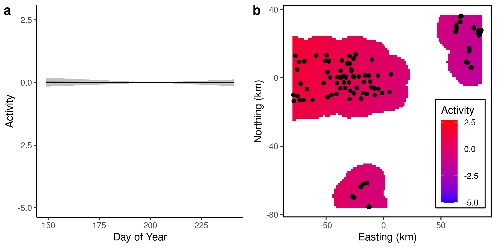

<!-- This argument in YAML header adds "manuscript_appendix.md" after document -->
<!-- output: -->
<!--   bookdown::html_document2: -->
<!--     pandoc_args: ["--include-after-body=manuscript_appendix.md"] -->

```{r setup, include=FALSE}
knitr::opts_chunk$set(echo = TRUE)
library(knitr)
library(tidyverse)
library(mgcv)

#Helper functions

#Capitalize
firstUpper <- function(x){
  paste0(toupper(substring(x,1,1)),substring(x,2,nchar(x)))
}

#Rounds to dig digits, converts to character, anything less than digits becomes "<0.xx1"
# Useful for tables
roundLess <- function(x,dig){
  x <- as.character(round(x,dig))
  x[x=='0'] <- paste0('<0.',strrep('0',dig-1),'1',collapse='')
  return(x)
}

boldRMD <- function(x) paste0('**',x,'**') #Makes text bold in rMarkdown
boldLaTeX <- function(x) paste0('\\textbf{',x,'}') #Makes text bold in LaTeX

#Load models
load('../data/PteMelMod.Rdata')
load('../data/ParDisMod.Rdata')
load('../data/ParMoeMod.Rdata')
load('../data/OpilioMod.Rdata')

#Extract Pterostichus melanarius results
pmelRes <- summary(PteMelMod$mod3)
pmelLinTerms <- pmelRes$p.table %>% as.data.frame() %>% 
  rownames_to_column('loc') %>% 
  mutate(loc=firstUpper(gsub('trapLoc','',loc))) %>% 
  rename(p='Pr(>|z|)') %>% mutate(p=roundLess(p,3)) %>% 
  mutate(sig=is.na(as.numeric(p))|as.numeric(p)<0.05) %>% #If p<0.05
  mutate(pTable=ifelse(sig,boldLaTeX(p),p)) %>% select(-sig) #Make text bold
pmelSmTerms <- pmelRes$s.table %>% as.data.frame() %>% 
  rownames_to_column('Smoother') %>% 
  rename(p='p-value') %>% mutate(p=roundLess(p,3)) %>% mutate_at(vars(2:4),roundLess,dig=2) %>% 
  mutate(sig=is.na(as.numeric(p))|as.numeric(p)<0.05) %>% #If p<0.05
  mutate(pTable=ifelse(sig,boldLaTeX(p),p)) %>% select(-sig) #Make text bold

#Extract Pardosa distincta results
pdisRes <- summary(ParDisMod$mod3)
pdisLinTerms <- pdisRes$p.table %>% as.data.frame() %>% 
  rownames_to_column('loc') %>% 
  mutate(loc=firstUpper(gsub('trapLoc','',loc))) %>% 
  rename(p='Pr(>|z|)') %>% mutate(p=roundLess(p,3)) %>% 
  mutate(sig=is.na(as.numeric(p))|as.numeric(p)<0.05) %>% #If p<0.05
  mutate(pTable=ifelse(sig,boldLaTeX(p),p)) %>% select(-sig) #Make text bold
pdisSmTerms <- pdisRes$s.table %>% as.data.frame() %>% 
  rownames_to_column('Smoother') %>% 
  rename(p='p-value') %>% mutate(p=roundLess(p,3)) %>% mutate_at(vars(2:4),roundLess,dig=2) %>% 
  mutate(sig=is.na(as.numeric(p))|as.numeric(p)<0.05) %>% #If p<0.05
  mutate(pTable=ifelse(sig,boldLaTeX(p),p)) %>% select(-sig) #Make text bold

#Extract Pardosa moesta results
pmoeRes <- summary(ParMoeMod$mod3)
pmoeLinTerms <- pmoeRes$p.table %>% as.data.frame() %>% 
  rownames_to_column('loc') %>% 
  mutate(loc=firstUpper(gsub('trapLoc','',loc))) %>% 
  rename(p='Pr(>|z|)') %>% mutate(p=roundLess(p,3)) %>% 
  mutate(sig=is.na(as.numeric(p))|as.numeric(p)<0.05) %>% #If p<0.05
  mutate(pTable=ifelse(sig,boldLaTeX(p),p)) %>% select(-sig) #Make text bold
pmoeSmTerms <- pmoeRes$s.table %>% as.data.frame() %>% 
  rownames_to_column('Smoother') %>% 
  rename(p='p-value') %>% mutate(p=roundLess(p,3)) %>% mutate_at(vars(2:4),roundLess,dig=2) %>% 
  mutate(sig=is.na(as.numeric(p))|as.numeric(p)<0.05) %>% #If p<0.05
  mutate(pTable=ifelse(sig,boldLaTeX(p),p)) %>% select(-sig) #Make text bold

#Extract Phalangium opilio results
opilRes <- summary(OpilioMod$mod3)
opilLinTerms <- opilRes$p.table %>% as.data.frame() %>% 
  rownames_to_column('loc') %>% 
  mutate(loc=firstUpper(gsub('trapLoc','',loc))) %>% 
  rename(p='Pr(>|z|)') %>% mutate(p=roundLess(p,3)) %>% 
  mutate(sig=is.na(as.numeric(p))|as.numeric(p)<0.05) %>% #If p<0.05
  mutate(pTable=ifelse(sig,boldLaTeX(p),p)) %>% select(-sig) #Make text bold
opilSmTerms <- opilRes$s.table %>% as.data.frame() %>% 
  rownames_to_column('Smoother') %>% 
  rename(p='p-value') %>% mutate(p=roundLess(p,3)) %>% mutate_at(vars(2:4),roundLess,dig=2) %>% 
  mutate(sig=is.na(as.numeric(p))|as.numeric(p)<0.05) %>% #If p<0.05
  mutate(pTable=ifelse(sig,boldLaTeX(p),p)) %>% select(-sig) #Make text bold

# #Extract concurvity from PteMel model
# mod3concurv <- concurvity(PteMelMod$mod3,FALSE)$estimate

#Get variance components
varComp <- rownames_to_column(data.frame(gam.vcomp(PteMelMod$mod3),spp='Pterostichus melanarius'),'term') %>% 
  bind_rows(rownames_to_column(data.frame(gam.vcomp(ParDisMod$mod3),spp='Pardosa distincta'),'term')) %>% 
  bind_rows(rownames_to_column(data.frame(gam.vcomp(OpilioMod$mod3),spp='Phalangium opilio'),'term')) %>%
  mutate(term=factor(term,levels=names(PteMelMod$mod3$sp)))

```

# Introduction

* Arthropod diversity is important to understand in agricultural systems
  + Pests can cause large amounts of damage
  + Beneficial insects can offset this
  + Important for global biodiversity - insects may be declining globally
  + Agriculture is ~36% of land worldwide
  + Potential for win-win scenarios
  
* Understanding of how landscape structure drives beneficial arthropod abundance is incomplete
  + Bees are generally driven by flower/nest substrate availability [@roulston2011]
  + Limited understanding of other arthropods (but see ``beetle hedges" from UK?)
  + Beetles are limited by water, food, and oviposition sites [@lovei1996]
  + No-till agriculture is better for some ground beetles [@busch_Msc]
  + Arachnids are similarly limited by food, shelter
  
* Landscape structure can influence abundance of beneficial arthropods in agricultural areas [@albrecht2010]
  + Spillover occurs when organisms migrate from suitable habitat patches
  + Can occur with pests or beneficial organisms [@woodcock2016]
  + Management goal: be able to design landscapes that benefit both farmers and insect diversity/abundance
  
* Point estimates of abundance are influenced by spatio-temporal processes 
  + Arthropods move between landscape components depending on their life history
  + e.g. Carabid beetles are thought to reproduce in field margins, but adults feed in fields [@desender1988]
  + This means that spillover depends not only on habitat type, but on time of the year
  + Certain habitat types may be sources of arthropods during some times of the year, but sinks during other times
  + Counts in pitfall traps are a proxy of activity density (not actual density), but this is probably an OK measure, at least within fields [@lang2000]
  
* In this study, we used pitfall trap counts of three species of beneficial arthropod to determine how landscape composition affects activity density of arthropods
  + We hypothesized that:
  1. Untilled semi-natural land (SNL) provides oviposition and feeding areas for beneficial arthropods, meaning that nearby SNL should act as a source of arthropods, depending on habitat preferences
  2. Crops in agricultural land attract pest insects during the growing season, and these insects are preyed upon by beneficial arthropods. However, pest phenology/crop senescence at the end of the season causes a decrease in the number of pests. This means that crop cover may act as a sink for beneficial insects early in the season as they migrate into the crop, and a source later on as they migrate out of the crop 

# Methods

## Data collection

* We used a system of pitfall traps installed at roadsides, field margins, wetlands, and in-field sites across southern Alberta in 2017 (_need a map here_)
  + Pitfall traps consisted of 582 mL Solo® cups buried up to the rim, partially filled with ethylene glycol
  + All traps had 2cm wire mounted over the rim to prevent small vertebrates from falling into the traps
  + Traps at roadsides were located 5m from the roads, while traps at in-field sites were installed 20, 100, 200m (?) along a transect from the nearest non-crop feature (wetland, grassland, pivot)
  + Specimens were collected from the traps every 14 days (SD: 2.9), and were identified to species
  
* We used three species of predatory arthropods that were present at very high abundances in the traps
  + _Pterostichus melanarius_ is predatory introduced ground beetle that is a wide-ranging generalist [@carcamo1994; @larsen2003; @busch_Msc]
  + It is commonly found in untilled grasslands [@purtauf2005] and grassy field margins may act as larval habitat [@desender1988]
  + _Pardosa distincta_ is a species of wolf spider that is common across the Canadian prairies, and is commonly found in ungrazed pastures [@carcamo2014]
  + Finally, _Phallangium opilio_ is a widely-distributed generalist harvestman, whose habitat preferences are poorly understood 
  
* To characterize landscape composition surrounding the traps, we used classified landscape data from @AAFC_data
  + AAFC cropland landscape classifications are very accurate for cultivated fields (~90%), but are less accurate for non-crop areas (~70%)
  + We extracted the landscape composition within a circle of a fixed radius surrounding each trap location 
  + However, the radius of the circle necessary to characterize the landscape depends on the ``grain" of the landscape that is relevant to the abundance of a given organism [@addicott1987]
  + Therefore, we divided the landscape into annuli (rings) surrounding each trap location.
  + Each annulus was 30 m thick, and had inner radii ranging from 30 to 1470m, in increments of 30m.
  + Using functional regression [@ramsay2004], we were able to incorporate landscape information at different distance, allowing us to assess the impact of both local and regional landscape composition 

  
## Statistics

* We used functional regression to model the effect of landscape composition on activity density 
  +  Scalar-on-function (SoF) regression is a special type of functional regression model ($\hat{y}=X\beta$), where the columns of the model matrix $X$ contain some continuous predictor of the scalar $y$ (e.g. biomass in a plot (scalar) as a function of monthly average temperatures (vector)), and the values of the coefficients ($\beta$) are modeled as a smooth function $f(x)$ of the predictors
  + In our case, each column represents the proportion of a given landscape cover class within each annulus, with increasing radii away from the location of the trap, and the coefficients are a smooth function of distance ($\beta_i = f(distance_i)$), meaning that the coefficients represent the (additive) effect of a given type of landscape cover and  from the trap 
  + This avoids the fundamental problem of choosing an optimal radius of landscape composition, and allows the possibility that the size of the landscape ``grain" relevant to a given organism may change over the course of its life stages [@addicott1987; @lima1996]
  + This technique has been used by other authors [@yen2014; @galpern2020]
  
* Activity density of each arthropod was  fit as generalized additive models @wood2017, using _mgcv_ version `r packageVersion('mgcv')` 
    + Count data of arthropods were fit using a negative binomial distribution
    + To account for different lengths of trap exposure, log-days since trap placement was used as a fixed effect with its slope held at 1 (``offset" variable)
    + To account for overall spatial and temporal autocorrelation in the data, we included day of year as a 1-dimensional smooth and easting and northing as a 2-dimensional smooth
    + For each landscape term, we used three SoF regression terms:
    + First, we used the proportion cover of all landscape cover classes in the annuli surrounding each trap location (spatial effect of cover class)
    + Second, we used day of the year multiplied by the proportion of cover classes in each annuli (temporal effect of cover class) 
    + Finally, we used a tensor-product interaction of landscape cover and day of year (spatio-temporal interaction of cover class)
    + We used 10 basis dimensions for the spatial and temporal landscape smoothers, and 16 basis dimensions for the spatio-temporal interaction
    + This was deemed adequate, as the effective degrees of freedom for all smoothing terms were far below the number of basis dimensions, indicating that no additional basis dimensions were needed (see Tables \@ref(tab:PteMelSmooth), \@ref(tab:ParDisSmooth), \@ref(tab:ParMoeSmooth), \@ref(tab:OpilioSmooth))
    + To remove unimportant terms from the model, we used thin-plate regression splines with shrinkage ("bs=`ts'" in _mgcv_)
    + This is a continuous analog to stepwise model selection, whereby weaker terms can be completely removed from the model, rather than just reduced to a line [@marra2011]
    <!-- + Double-penalization gave qualitatively similar results, but required twice the number of penalty terms, and some of the penalty terms were unstable  -->
  
* Functional regression plots of landscape composition reveal which cover classes are acting as sources or sinks of organisms
  + Positive responses to nearby landscape cover classes indicate that the cover class acts as a source (i.e. arthropods spill over *from* it)
  + However, negative responses to nearby landscape cover classes can indicate one of two things:
  + 1) It may indicate that the cover class acts as a sink (i.e. organisms spill over *into* it)
  + 2) It may indicate that the cover class acts as a source, but it is unoccupied (i.e. no organisms available to spill over)
  + We consider 1) to be the more likely scenario, as it is unlikely that any one cover class is *completely* unoccupied
  + This model does not consider the next-generation fitness consequences of spillover
  + For example, a cover class with low-quality habitat could act as an ecological trap [@galpern2017] if it acts as a sink but never as a source
  + Alternatively, a cover class could act as a sink by providing high-quality habitat at certain times of the year (e.g. egg laying/feeding), but act as a source at other times (e.g. during emergence)
  
* Some of the landscape terms in our model were strongly concurved, so we removed them from the model or combined them into a single term
  + Concurvity is an non-linear analogue of multicollinearity that can bias estimates of standard errors [@buja1989]
  + There is no agreed-upon threshold of unacceptable concurvity, but 0.5 is commonly used [@dominici2002; @ramsay2003] 
  + Some landscape terms were strongly concurved (Figure \@ref(fig:concurvity)), namely forest and shrubland (max: 0.71), canola and cereal (max: 0.74), and grassland and wetland (max: 0.63)
  + Forest and shrubland were combined into the ``TreeShrub" category, grassland and wetland were combined into the "GrassWetland" category, as they were strongly positively correlated at all distances, indicating similar feature classes
  + Cereal was removed from the model, as it was negatively correlated with canola at distances less than 200m and positively correlated at distances over 500m, likely reflecting the most common crop rotations and landscape structure present across our study region
  
<!-- * We used 4 nested models to gauge the relative importance of landscape composition for arthropod activity density -->
<!--   + Model 1 consisted of a temporal and spatial smoothers (``random effects"), necessary to account for the underlying spatiotemporal structure of the data  -->
<!--   + Smoothers can be thought of as random effects, where the coefficients follow a probability distribution defined by a fixed smoothing coefficient $\lambda$ [@wood2017]  -->
<!--   + Model 2 added a local cover term, to account for the specific effect of local cover on activity density -->
<!--   + Model 3 added a smoother term for the landscape rings, modeling the effect of non-crop cover at varying distances on activity density -->
<!--   + Model 4, similar to model 3, modeled the effect of all underlying cover classes (crop and non-crop) at varying distances -->

<!-- Model    | Independent variables                                     | $r$ Formula -->
<!-- -------- | --------------------------------------------------------- | ----------------------------------------------- -->
<!-- 1        | Phenology + Geography                                     | Activity Density ~ s(Day) + s(E,N) -->
<!-- 2        | Phenology + Geography + Local cover                       | Activity Density ~ s(Day) + s(E,N) + Trap Location -->
<!-- 3        | Phenology + Geography + Local cover + Landscape (general) | Activity Density ~ s(Day) + s(E,N) + Trap Location + s(Non-crop Cover)                          -->
<!-- 4        | Phenology + Geography + Local cover + Landscape (specific)| Activity Density ~ s(Day) + s(E,N) + Trap Location + s(Cover 1) + s(Cover 2) + ... + s(Cover n) -->

# Results

## *Ground beetle:* Pterostichus melanarius

* _P. melanarius_ activity density was strongly influenced by trap location and landscape composition (Tables \@ref(tab:PteMelLinear), \@ref(tab:PteMelSmooth))
  + Canola crops had a higher activity density of _P. melanarius_ than any other trap location, while roadside ditches had the lowest (Figure \@ref(fig:PteMelLandscape)a) 
  + This indicates that low-density stands of canola may allow faster movement of ground beetles.
  + In landscape composition, proportion of urban land cover (roadside right-of-way) was the strongest predictor of activity density, and this varied across the season, with urban land acting as a sink during June, but becoming a source during July (Figure \@ref(fig:PteMelLandscape)f); trees and shrubs followed a similar pattern (Figure \@ref(fig:PteMelLandscape)d)
  + Wetland cover had a negative influence on _P. melanarius_ activity density, but only after mid-July, indicating that wetlands may act as a sink for _P. melanarius_ populations later in the season
  + Finally, _P. melanarius_ activity density had a very strong temporal and spatial component (both p<0.001), indicating that phenology and local geographic factors were strong drivers of ground beetle activity density (Figure \@ref(fig:PteMelSpatiotemporal))
  + Together, the landscape composition and the spatio-temporal component explained `r round(with(PteMelMod,summary(mod3)$dev.expl),3)*100`% of deviance
  <!-- + This could be related to climatic drivers (rainfall, growing degree days), or could simply represent a single yearly realization of a spatio-temporal random field  -->

```{r PteMelLandscape, echo=FALSE, fig.cap='Landscape influence on _Pterostichus melanarius_ activity density. Lines/dots represent means, and bars/shaded regions represent 95% confidence intervals (1.96 x SE). Coloured regions represent early-, mid-, and late-season effects (red, green, blue)'}  
  include_graphics('../figures/Pterostichus_melanarius_fixeff.png')
```

```{r PteMelSpatiotemporal, echo=FALSE, fig.cap='Temporal and spatial components of _Pterostichus melanarius_ activity density'}
  include_graphics('../figures/Pterostichus_melanarius_raneff.png')
```

## *Wolf spiders:* Pardosa distincta *and* Pardosa moesta

* _Pardosa distincta_ activity density was also strongly influenced by trap location and landscape composition (Tables \@ref(tab:ParDisLinear), \@ref(tab:ParDisSmooth)), similar to _P. melanarius_.
  + Unlike _P. melanarius_, _P. distincta_ had far lower activity density in canola than any other cover type (Figure \@ref(fig:ParDisLandscape)a).
  + Interestingly, nearby canola appeared to act as a source of _P. distincta_ for surrounding landscape features, as activity density was positively related to the nearby proportion of canola (p = `r with(pdisSmTerms,p[Smoother=='s(distMat):Canola'])`), and that this effect was slightly stronger early in the season (p = `r with(pdisSmTerms,p[Smoother=='s(endDayMat):Canola'])`)
  + Pulse crops had a similar effect, acting as a source of _P. distincta_ early in the season, and acting as a mild sink later in the season (p = `r with(pdisSmTerms,p[Smoother=='ti(distMat,endDayMat):Pulses'])`, Figure \@ref(fig:ParDisLandscape)d)
  + Grassland acted as a weak sink in the middle of the season (p = `r with(pdisSmTerms,p[Smoother=='s(endDayMat):Grassland'])`), and urban cover acted as a weak sink at intermediate distances (~600m) 
  <!-- How should this be interpreted? -->
  + Similar to _P. melanarius_, _P. distincta_ activity density had a very strong temporal and spatial component (both p = `r with(pdisSmTerms,p[grepl('E,N',Smoother)])`, Figure \@ref(fig:ParDisCoefs-raneff)) 
  + The landscape composition and the spatio-temporal component explained `r round(with(ParDisMod,summary(mod3)$dev.expl),3)*100`% of deviance


```{r ParDisLandscape, echo=FALSE, fig.cap='Landscape influence on _Pardosa distincta_ activity density. Lines/dots represent means, and bars/shaded regions represent 95% confidence intervals (1.96 x SE). Coloured regions represent early-, mid-, and late-season effects (red, green, blue)'}  
  include_graphics('../figures/Pardosa_distincta_fixeff.png')
```

```{r ParDisCoefs-raneff, echo=FALSE, fig.cap='Temporal and spatial components of _Pardosa distincta_ activity density'}
  include_graphics('../figures/Pardosa_distincta_raneff.png')
```

* _P. moesta_ was also heavily influenced by trap location and landscape composition (Tables \@ref(tab:ParMoeLinear), \@ref(tab:ParMoeSmooth))
  + Like its sister species _P. distincta_, _P. moesta_ had much lower activity density in canola than any other trap location (Figure \@ref(fig:ParMoeLandscape)a)
  + Nearby canola also acted as a source of _P. moesta_ (Figure \@ref(fig:ParMoeLandscape)b, p = `r with(pmoeSmTerms,p[Smoother=='s(distMat):Canola'])`), although the effect was only strong at the end of the season (p = `r with(pmoeSmTerms,p[Smoother=='ti(distMat,endDayMat):Canola'])`)
  + This indicates that both _P. distincta_ and _P. moesta_ may migrate out of canola into adjacent habitat in order to overwinter or oviposit
  + _P. moesta_ also had similar responses to pulses (Figures \@ref(fig:ParMoeLandscape)d)
  + _P. moesta_ responded negatively to nearby tree and shrub cover, indicating that they are possible sinks of 
  + Urban land cover acted as a sink, but only at certain times of the year
  + The landscape composition and the spatio-temporal component explained `r round(with(ParMoeMod,summary(mod3)$dev.expl),3)*100`% of deviance

```{r ParMoeLandscape, echo=FALSE, fig.cap='Landscape influence on \\emph{Pardosa moesta} activity density. Lines/dots represent means, and bars/shaded regions represent 95% confidence intervals (1.96 x SE). Coloured regions represent early-, mid-, and late-season effects (red, green, blue)'}  
  include_graphics('../figures/Pardosa_moesta_fixeff.png')
```

```{r ParMoeSpatiotemporal, echo=FALSE, fig.cap='Temporal and spatial components of \\emph{Pardosa moesta} activity density'}
  
```

## *Harvestman:* Phalangium opilio 

* _Phalangium opilio_ activity density was strongly influenced by trap location, with pivot corners and wetlands having the highest activity density (p = `r with(opilLinTerms, p[loc=='Pivot'])`, `r with(opilLinTerms, p[loc=='Wetland'])`)  
  + However, unlike _P. melanarius_ or _P. pardosa_, _P. opilio_ was not strongly influenced by any land cover type, except for Pasture (p = `r with(opilSmTerms,p[Smoother=='ti(distMat,endDayMat):Pasture'])`)
  + This effect of this specific land cover type was not very large, as the model using non-crop cover performed similarly ($\Delta AIC$= `r with(OpilioMod, sprintf("%.2f",AIC(mod3)-AIC(mod4)))`)
  + In fact, the models that used landscape composition performed worse than the model with only trap location ($\Delta AIC$= `r with(OpilioMod, sprintf("%.2f",AIC(mod2)-AIC(mod3)))`, `r with(OpilioMod, sprintf("%.2f",AIC(mod2)-AIC(mod4)))`), indicating a weak effect of landscape composition
  + The temporal and spatial components, as in the other two species, were both very strong (both p = `r with(opilSmTerms,p[grepl('E,N',Smoother)])`)
  + Together, these results indicate that _P. opilio_ activity density is influenced by large-scale geographic patterns rather than landscape composition
  + The landscape composition and the spatio-temporal component explained `r round(with(OpilioMod,summary(mod3)$dev.expl),3)*100`% of deviance

```{r OpilioLandscape, echo=FALSE, fig.cap='Landscape influence on _Phalangium opilio_ activity density. Lines/dots represent means, and bars/shaded regions represent 95% confidence regions. Dashed line on panels b-f represents zero effect. Coloured regions represent early-, mid-, and late-season effects (red, green, blue)'}  
  include_graphics('../figures/Opiliones_fixeff.png')
```

```{r OpilioSpatiotemporal, echo=FALSE, fig.cap='Temporal and spatial components of _Phalangium opilio_ activity density'}
  include_graphics('../figures/Opiliones_raneff.png')
```

# Discussion

* We found that while _Pterostichus melanarius_, _Pardosa distincta_, and _Pardosa moesta_ responded to landscape composition, _Phalangium opilio_ did not
  + _P. melanarius_ was influenced by grassland/wetland, pasture, trees/shrubs, pulses, and urban land cover
  + _P. distincta_ was influenced by grassland/wetland, canola, pulses, and urban land cover
  + _P. moesta_ was influenced by the same landscape components: grassland/wetland, canola, pulses, and urban land cover
  + Finally, _P. opilio_ was weakly influenced by pasture, and trees/shrubs
  + These results highlight the seasonal importance of non-crop marginal lands for predatory arthropod abundance (Table \@ref(tab:sumTab))
  
Table: (\#tab:sumTab) Summary table of results. Early, mid, and late indicate the time of the season when cover classes had strong effects on abundance.
  
Cover class      | _Pterostichus melanarius_| _Pardosa distincta_      | _Pardosa moesta_     | _Phalangium opilio_
---------------- | -----------------------  | ------------------------ | -------------------  | ------------
Grass/ Wetland   | Late sink                | Late sink (weak)         |                      |
Canola           |                          | Source                   | Source               |
Pasture          | Early source             |                          |                      | Early sink, Late source
Trees/ Shrubland | Early sink, Late source  |                          | Source               | Early sink, Mid source (weak)
Pulses           | Source                   | Early source, Late sink  | Sink                 |
Urban            | Early sink, Mid source   | Sink                     | Mid sink (weak)      |

* The predatory ground beetle _Pterostichus melanarius_ responded to landscape composition, and responded most strongly to urban and tree/shrub cover
  + _P. melanarius_ is found in a wide variety of habitats, but tends to prefer agricultural fields [@larsen2003]
  + Other studies have found similar results, suggesting that untilled land is important off-field habitat for carabids [@desender1988, @fournier2002, but see @hatten2007]
 + In particular, @purtauf2005 found that carabid density increased with proportion of nearby grasslands; our finding of grassland/wetland as late-season sink may represent _P. melanarius_ moving to overwintering habitat at the end of the season
 + We also identified several other candidate land cover types as early- and mid-season sources of _P. melanarius_, namely urban, pasture, and pulse crops (primarily lentils in Alberta)
 + The roles that carabids play in pulse crops is not well-studied, but carabids are known predators of pea-leaf weevils (_Sitona lineatus_) on other Fabacea [@hamon1990], so it is possible that pulses represent a source of spill-over
 + Alternatively, _P. melanarius_ is known to predate upon other carabid predators of _S. lineatus_ (_Bembidion quadrimaculatum_, @vankosky2011)
 <!-- + Carabid diversity is higher in no-till agriculture [@bourassa2008, @puech2014] -->
 
* The Lycosid spiders _Pardosa distincta_ and _Pardosa moesta_ responded to landscape composition, in particular, pulses, canola, urban, and trees/shrubs 
  + Surprisingly, canola acted as a source for both species, indicating that _Pardosa_ may use canola as foraging grounds
  + Similar to our findings, @drapela2011 also found that _Pardosa agresti_ had higher activity density in areas with more woody trees and shrubs, as well as in areas close to roadside strips, suggesting similar habitat preferences in Canadian and European contexts
  

* The harvestman _Phalangium opilio_ did not respond to landscape composition

* The influence of landscape composition tended to be limited to a radius of about 500m, indicating that large-scale land cover may have a stronger effect on arthropod abundance than small-scale land cover

* There was a strong temporal component to the landscape effects, meaning that it is important to consider how sinks and sources may change over the season
  + We did not consider the influence of previous years' crops, although carabids tend to be more abundant in areas of high crop rotation [@busch_Msc, @bertrand2015]

* These patterns indicate movement between landscape features, but since we did not directly observe arthropod movement between features, future studies should examine this
  + Mark-recapture studies, monitoring movement patterns (e.g. radio tags), or two-sided traps could be useful
  + Should also be linked to ecosystem services (e.g. predation on bait insects or weed seeds)


\newpage 

# Supplementary Material {-}

\beginsupplement

```{r concurvity, echo=FALSE, fig.cap='Concurvity estimates for top land cover classes'}  
  include_graphics('../figures/coverCorPlots/concurvityEstimate.png')
```


```{r PteMelLinear, echo=FALSE, warning=FALSE}
pmelLinTerms %>% select(-p) %>% 
  kable(.,caption='Linear terms for \\emph{Pterostichus melanarius}',col.names=c('Trap location','$\\beta$','S.E.','Z','p'),
      digits=c(1,2,2,2,2),align='rrrrl',escape=FALSE)
```


```{r PteMelSmooth, echo=FALSE, warning=FALSE}
pmelSmTerms %>% select(-Ref.df,-p) %>% 
  kable(.,caption='Smooth terms for \\emph{Pterostichus melanarius}. \\emph{s} indicates a thin-plate spline, \\emph{ti} indicates a tensor-product interaction. All terms except for day and (E,N) are functional regression fits.',
      col.names=c('Smoothing term','E.d.f.','$\\chi^2$','p'),
      digits=c(1,2,2,2),align='rrll',escape=FALSE)
```

```{r ParDisLinear, echo=FALSE, warning=FALSE}
pdisLinTerms %>% select(-p) %>% 
  kable(.,caption='Linear terms for \\emph{Pardosa distincta}. Line',col.names=c('Trap location','$\\beta$','S.E.','Z','p'),
        digits=c(1,2,2,2,2),align='rrrrl',escape=FALSE)
```

```{r ParDisSmooth, echo=FALSE, warning=FALSE}
pdisSmTerms %>% select(-Ref.df,-p) %>% 
  kable(.,caption='Smooth terms for \\emph{Pardosa distincta}. \\emph{s} indicates a thin-plate spline, \\emph{ti} indicates a tensor-product interaction. All terms except for day and (E,N) are functional regression fits.',
        col.names=c('Smoothing term','E.d.f.','$\\chi^2$','p'),
        digits=c(1,2,2,2),align='rrll',escape=FALSE)
```

```{r ParMoeLinear, echo=FALSE, warning=FALSE}
pmoeLinTerms %>% select(-p) %>% 
  kable(.,caption='Linear terms for \\emph{Pardosa moesta}. Line',col.names=c('Trap location','$\\beta$','S.E.','Z','p'),
        digits=c(1,2,2,2,2),align='rrrrl',escape=FALSE)
```

```{r ParMoeSmooth, echo=FALSE, warning=FALSE}
pmoeSmTerms %>% select(-Ref.df,-p) %>% 
  kable(.,caption='Smooth terms for \\emph{Pardosa moesta}. \\emph{s} indicates a thin-plate spline, \\emph{ti} indicates a tensor-product interaction. All terms except for day and (E,N) are functional regression fits.',
        col.names=c('Smoothing term','E.d.f.','$\\chi^2$','p'),
        digits=c(1,2,2,2),align='rrll',escape=FALSE)
```

```{r OpilioLinear, echo=FALSE, warning=FALSE}
opilLinTerms %>% select(-p) %>% 
  kable(.,caption='Linear terms for \\emph{Phalangium opilio}',col.names=c('Trap location','$\\beta$','S.E.','Z','p'),
        digits=c(1,2,2,2,2),align='rrrrl',escape=FALSE)
```

```{r OpilioSmooth, echo=FALSE, warning=FALSE}
opilSmTerms %>% select(-Ref.df,-p) %>% 
  kable(.,caption='Smooth terms for \\emph{Phalangium opilio}. \\emph{s} indicates a thin-plate spline, \\emph{ti} indicates a tensor-product interaction. All terms except for day and (E,N) are functional regression fits.',
        col.names=c('Smoothing term','E.d.f.','$\\chi^2$','p'),
        digits=c(1,2,2,2),align='rrll',escape=FALSE)
```

# References