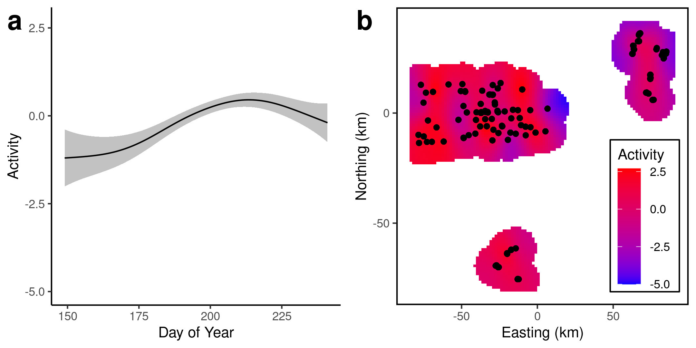
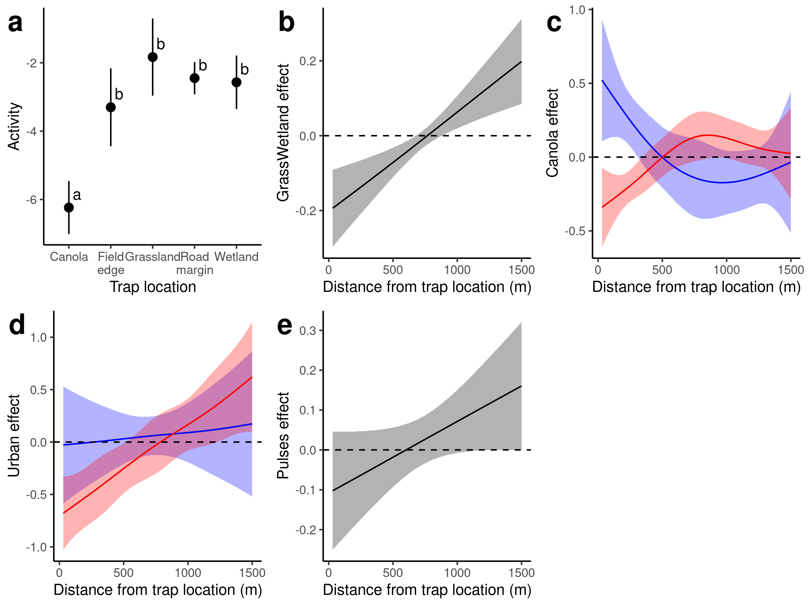

<!-- This argument in YAML header adds "manuscript_appendix.md" after document -->
<!-- output: -->
<!--   bookdown::html_document2: -->
<!--     pandoc_args: ["--include-after-body=manuscript_appendix.md"] -->

```{r setup, include=FALSE}
knitr::opts_chunk$set(echo = TRUE)
library(knitr)
library(tidyverse)
library(mgcv)

#Helper functions

#Capitalize
firstUpper <- function(x){
  paste0(toupper(substring(x,1,1)),substring(x,2,nchar(x)))
}

#Rounds to dig digits, converts to character, anything less than digits becomes "<0.xx1"
# Useful for tables
roundLess <- function(x,dig){
  x <- as.character(round(x,dig))
  x[x=='0'] <- paste0('<0.',strrep('0',dig-1),'1',collapse='')
  return(x)
}

boldRMD <- function(x) paste0('**',x,'**') #Makes text bold in rMarkdown
boldLaTeX <- function(x) paste0('\\textbf{',x,'}') #Makes text bold in LaTeX

#Load models
load('../data/PteMelMod.Rdata')
load('../data/ParDisMod.Rdata')
load('../data/OpilioMod.Rdata')

#Extract Pterostichus melanarius results
pmelRes <- summary(PteMelMod$mod3)
pmelLinTerms <- pmelRes$p.table %>% as.data.frame() %>% 
  rownames_to_column('loc') %>% 
  mutate(loc=firstUpper(gsub('trapLoc','',loc))) %>% 
  rename(p='Pr(>|z|)') %>% mutate(p=roundLess(p,3)) %>% 
  mutate(sig=is.na(as.numeric(p))|as.numeric(p)<0.05) %>% #If p<0.05
  mutate(pTable=ifelse(sig,boldLaTeX(p),p)) %>% select(-sig) #Make text bold
pmelSmTerms <- pmelRes$s.table %>% as.data.frame() %>% 
  rownames_to_column('Smoother') %>% 
  rename(p='p-value') %>% mutate(p=roundLess(p,3)) %>% mutate_at(vars(2:4),roundLess,dig=2) %>% 
  mutate(sig=is.na(as.numeric(p))|as.numeric(p)<0.05) %>% #If p<0.05
  mutate(pTable=ifelse(sig,boldLaTeX(p),p)) %>% select(-sig) #Make text bold

#Extract Pardosa distincta results
pdisRes <- summary(ParDisMod$mod3)
pdisLinTerms <- pdisRes$p.table %>% as.data.frame() %>% 
  rownames_to_column('loc') %>% 
  mutate(loc=firstUpper(gsub('trapLoc','',loc))) %>% 
  rename(p='Pr(>|z|)') %>% mutate(p=roundLess(p,3)) %>% 
  mutate(sig=is.na(as.numeric(p))|as.numeric(p)<0.05) %>% #If p<0.05
  mutate(pTable=ifelse(sig,boldLaTeX(p),p)) %>% select(-sig) #Make text bold
pdisSmTerms <- pdisRes$s.table %>% as.data.frame() %>% 
  rownames_to_column('Smoother') %>% 
  rename(p='p-value') %>% mutate(p=roundLess(p,3)) %>% mutate_at(vars(2:4),roundLess,dig=2) %>% 
  mutate(sig=is.na(as.numeric(p))|as.numeric(p)<0.05) %>% #If p<0.05
  mutate(pTable=ifelse(sig,boldLaTeX(p),p)) %>% select(-sig) #Make text bold

#Extract Phalangium opilio results
opilRes <- summary(OpilioMod$mod3)
opilLinTerms <- opilRes$p.table %>% as.data.frame() %>% 
  rownames_to_column('loc') %>% 
  mutate(loc=firstUpper(gsub('trapLoc','',loc))) %>% 
  rename(p='Pr(>|z|)') %>% mutate(p=roundLess(p,3)) %>% 
  mutate(sig=is.na(as.numeric(p))|as.numeric(p)<0.05) %>% #If p<0.05
  mutate(pTable=ifelse(sig,boldLaTeX(p),p)) %>% select(-sig) #Make text bold
opilSmTerms <- opilRes$s.table %>% as.data.frame() %>% 
  rownames_to_column('Smoother') %>% 
  rename(p='p-value') %>% mutate(p=roundLess(p,3)) %>% mutate_at(vars(2:4),roundLess,dig=2) %>% 
  mutate(sig=is.na(as.numeric(p))|as.numeric(p)<0.05) %>% #If p<0.05
  mutate(pTable=ifelse(sig,boldLaTeX(p),p)) %>% select(-sig) #Make text bold

#Get variance components
varComp <- rownames_to_column(data.frame(gam.vcomp(PteMelMod$mod3),spp='Pterostichus melanarius'),'term') %>% 
  bind_rows(rownames_to_column(data.frame(gam.vcomp(ParDisMod$mod3),spp='Pardosa distincta'),'term')) %>% 
  bind_rows(rownames_to_column(data.frame(gam.vcomp(OpilioMod$mod3),spp='Phalangium opilio'),'term')) %>%
  mutate(term=factor(term,levels=names(PteMelMod$mod3$sp)))

```

# Introduction

* Arthropod diversity is important to understand in agricultural systems
  + Pests can cause large amounts of damage
  + Beneficial insects can offset this
  + Important for global biodiversity - insects may be declining globally
  + Agriculture is ~36% of land worldwide
  + Potential for win-win scenarios
  
* We don't have a good understanding of what drives beneficial arthropod abundance
  + Bees are generally driven by flower/nest substrate availability [@roulston2011]
  + Limited understanding of other arthropods
  + Beetles are limited by water, food, and oviposition sites [@lovei1996]
  + Arachnids are similarly limited by food, shelter
  
* Landscape structure can influence abundance of beneficial arthropods in agricultural areas [@albrecht2010]
  + No-till agriculture is better for some ground beetles [@busch_Msc]
  + How can we design landscapes to benefit both farmers and insects?
  
* Point estimates of abundance are influenced by spatio-temporal processes 
  + Arthropods move between landscape components depending on their life history
  + e.g. Carabid beetles are thought to reproduce in field margins, but adults feed in fields [@desender1988]
  + Counts in pitfall traps are a proxy of activity density (not actual density), but this is probably an OK measure, at least within fields [@lang2000]
* In this study, we used pitfall trap counts of three species of beneficial arthropod to determine how landscape composition affects activity density of arthropods
  + We hypothesized that:
  1. Abundance of semi-natural land (SNL) would result in increased arthropod abundance
  2. Nearby SNL acts as a source of arthropods earlier in the season, and act as a sink later on, as arthropods migrate into margins to reproduce

# Methods

## Data collection

* We used a system of pitfall traps installed at roadsides, field margins, wetlands, and in-field sites across southern Alberta in 2017 (_need a map here_)
  + Pitfall traps consisted of 582 mL Solo® cups buried up to the rim, partially filled with ethylene glycol
  + All traps had 2cm chicken wire mounted over the rim to prevent small vertebrates from falling into the traps
  + Traps at roadsides were located 5m from the roads, while traps at in-field sites were installed 20, 100, 200m (?) along a transect from the nearest non-crop feature (wetland, grassland, pivot)
  + Specimens were collected from the traps every 14 days (SD: 2.9), and were identified to species
  
* We used three species of predatory arthropods that were present at very high abundances in the traps
  + _Pterostichus melanarius_ is predatory introduced ground beetle that is a wide-ranging generalist [@carcamo1994; @larsen2003; @busch_Msc]
  + It is commonly found in untilled grasslands [@purtauf2005] and grassy field margins may act as larval habitat [@desender1988]
  + _Pardosa distincta_ is a species of wolf spider that is common across the Canadian prairies, and is commonly found in ungrazed pastures [@carcamo2014]
  + Finally, _Phallangium opilio_ is a widely-distributed harvestman that lives in 
  
* We modeled arthropod activity density as a function of landscape composition using generalized additive models @wood2017
    + To account for different lengths of trap exposure, log-days since trap placement was used as a fixed effect with its slope held at 1 (``offset" variable)
    + All models were fit using a negative binomial distribution
    + We fit our functional regression models using _mgcv_ version `r packageVersion('mgcv')`
  
* To characterize landscape composition surrounding the traps, we used classified landscape data from @AAFC_data
  + AAFC cropland landscape classifications are very accurate for cultivated fields (~90%), but are less accurate for non-crop areas (~70%)
  + We extracted the landscape composition within a circle of a fixed radius surrounding each trap location 
  + However, the radius of the circle necessary to characterize the landscape depends on the ``grain" of the landscape that is relevant to the abundance of a given organism [@addicott1987]
  + Therefore, we divided the landscape into annuli (rings) surrounding each trap location.
  + Each annulus was 30 m thick, and had inner radii ranging from 30 to 1470m, in increments of 30m.
  + Using functional regression [@ramsay2004], we were able to incorporate landscape information at different distance, allowing us to assess the impact of both local and regional landscape composition 

  
## Statistics

* We used functional regression to model the effect of landscape composition on activity density 
  +  Scalar-on-function (SoF) regression is a special type of functional linear regression model ($\hat{y}=X\beta$), where the columns of the model matrix $X$ contain some continuous predictor of the scalar $y$ (e.g. biomass in a plot (scalar) as a function of monthly average temperatures (vector)), and the values of the coefficients ($\beta$) are modeled as a smooth function $f(x)$ of the predictors
  + In our case, each column represents the proportion of a given landscape cover class within each annulus, with increasing radii away from the location of the trap, and the coefficients are a smooth function of distance ($\beta_i = f(distance_i)$), meaning that the coefficients represent the (additive) effect of a given type of landscape cover and  from the trap 
  + This avoids the fundamental problem of choosing an optimal radius of landscape composition, and allows the possibility that the size of the landscape ``grain" relevant to a given organism may change over the course of its life stages [@addicott1987; @lima1996]
  + This technique has been used by other authors [@yen2014; @galpern2020]
  
* Some of the landscape terms in our model were strongly concurved, so we removed them from the model, or combined them into a single term
  + Concurvity is an non-linear analogue of multicollinearity that can bias estimates of standard errors [@buja1989; @ramsay2003]
  + There is no agreed-upon threshold of unacceptable concurvity, but 0.5 is commonly used [@dominici2002; @ramsay2003] 
  + We found that some landscape terms were strongly concurved (Figure \@ref(fig:concurvity)), namely shrubland and forest (max: 0.71), canola and cereal (max: 0.74), and wetland and grassland (max: 0.63)
  

<!-- * We used 4 nested models to gauge the relative importance of landscape composition for arthropod activity density -->
<!--   + Model 1 consisted of a temporal and spatial smoothers (``random effects"), necessary to account for the underlying spatiotemporal structure of the data  -->
<!--   + Smoothers can be thought of as random effects, where the coefficients follow a probability distribution defined by a fixed smoothing coefficient $\lambda$ [@wood2017]  -->
<!--   + Model 2 added a local cover term, to account for the specific effect of local cover on activity density -->
<!--   + Model 3 added a smoother term for the landscape rings, modeling the effect of non-crop cover at varying distances on activity density -->
<!--   + Model 4, similar to model 3, modeled the effect of all underlying cover classes (crop and non-crop) at varying distances -->

<!-- Model    | Independent variables                                     | $r$ Formula -->
<!-- -------- | --------------------------------------------------------- | ----------------------------------------------- -->
<!-- 1        | Phenology + Geography                                     | Activity Density ~ s(Day) + s(E,N) -->
<!-- 2        | Phenology + Geography + Local cover                       | Activity Density ~ s(Day) + s(E,N) + Trap Location -->
<!-- 3        | Phenology + Geography + Local cover + Landscape (general) | Activity Density ~ s(Day) + s(E,N) + Trap Location + s(Non-crop Cover)                          -->
<!-- 4        | Phenology + Geography + Local cover + Landscape (specific)| Activity Density ~ s(Day) + s(E,N) + Trap Location + s(Cover 1) + s(Cover 2) + ... + s(Cover n) -->

# Results

## _Pterostichus melanarius_

* _P. melanarius_ activity density was strongly influenced by trap location and landscape composition (Tables \@ref(tab:PteMelCoefs-linTerms), \@ref(tab:PteMelCoefs-smoothTerms))
  + Canola crops had a higher activity density of _P. melanarius_ than any other trap location, while roadside ditches had the lowest (Figure \@ref(fig:PteMelCoefs-fixeff)a)
  + This indicates that low-density stands of canola may allow faster movement of ground beetles.
  + In landscape composition, proportion of urban land cover (roadside right-of-way) was the strongest predictor of activity density, and this varied across the season, with urban land acting as a sink during June, but becoming a source during July (Figure \@ref(fig:PteMelCoefs-fixeff)f); trees and shrubs followed a similar pattern (Figure \@ref(fig:PteMelCoefs-fixeff)d)
  + Wetland cover had a negative influence on _P. melanarius_ activity density, but only after mid-July, indicating that wetlands may act as a sink for _P. melanarius_ populations later in the season

```{r PteMelCoefs-linTerms, echo=FALSE, warning=FALSE}
pmelLinTerms %>% select(-p) %>% 
  kable(.,caption='Linear terms for \\emph{Pterostichus melanarius}',
      col.names=c('Trap location','$\\beta$','S.E.','Z','p'),
      digits=c(1,2,2,2,2),align='rrrrl',escape=FALSE)
```


```{r PteMelCoefs-smoothTerms, echo=FALSE, warning=FALSE}

pmelSmTerms %>% select(-Ref.df,-p) %>% 
  kable(.,caption='Smooth terms for \\emph{Pterostichus melanarius}. \\emph{s} indicates a thin-plate spline, \\emph{ti} indicates a tensor-product interaction. All terms except for day and (E,N) are functional regression fits.',
      col.names=c('Smoothing term','Eff. _df_','$\\chi^2$','_p_'),
      digits=c(1,2,2,2),align='rrll',escape=TRUE)
```

```{r PteMelCoefs-fixeff, echo=FALSE, fig.cap='\\label{fig:PteMelCoefs-fixeff} Landscape influence on _Pterostichus melanarius_ activity density. Lines/dots represent means, and bars/shaded regions represent 95% confidence intervals (1.96 x SE). Dashed line on panels b-f represents zero effect. Coloured regions represent early-, mid-, and late-season effects (red, green, blue)'}  
  include_graphics('../figures/Pterostichus_melanarius_fixeff.png')
```

*  _P. melanarius_ had a very strong random temporal and spatial component (both p<0.001), indicating that phenology and local geographic factors were strong drivers of ground beetle activity density (Figure \@ref(fig:PteMelCoefs-raneff))
  + This could be related to climatic drivers (rainfall, growing degree days), or could simply represent a single yearly realization of a spatio-temporal random field 

```{r PteMelCoefs-raneff, echo=FALSE, fig.cap='\\label{fig:PteMelCoefs-raneff} Temporal and spatial components of _Pterostichus melanarius_ activity density'}
  
```

## _Pardosa distincta_ 

* _Pardosa distincta_ activity density was also strongly influenced by trap location and landscape composition (Tables \@ref(tab:ParDisCoefs-linTerms), \@ref(tab:ParDisCoefs-smoothTerms)), similar to _P. melanarius_.
  + However, _P. distincta_ had far lower activity density in canola than any other cover type (Figure \@ref(fig:ParDisCoefs-fixeff)a).
  + Interestingly, nearby canola appeared to act as a source of _P. distincta_ for surrounding landscape features, as activity density was positively related to the nearby proportion of canola (p = `r with(pdisSmTerms,pTable[Smoother=='s(distMat):Canola'])`), at least early in the season (p = `r with(pdisSmTerms,pTable[Smoother=='s(endDayMat):Canola'])`)
  + Pulse crops had a similar effect, acting as a source of _P. distincta_ early in the season, and acting as a mild sink later in the season (p = `r with(pdisSmTerms,pTable[Smoother=='ti(distMat,endDayMat):Pulses'])`, Figure \@ref(fig:ParDisCoefs-fixeff)d)
  + Grassland acted as a weak source, at least earlier on in the season (p = `r with(pdisSmTerms,pTable[Smoother=='s(endDayMat):Grassland'])`), and urban cover acted as a weak sink at intermediate distances (~600m)
  + Similar to _P. melanarius_, _P. distincta_ activity density had a very strong temporal and spatial component (both p = `r with(pdisSmTerms,pTable[grepl('E,N',Smoother)])`, Figure \@ref(fig:ParDisCoefs-raneff)) 

```{r ParDisCoefs-linTerms, echo=FALSE, warning=FALSE}
pdisLinTerms %>% select(-p) %>% 
  kable(.,caption='\\label{tab:ParDisCoefs-linTerms} Linear terms for _Pardosa distincta_. Line',col.names=c('Trap location','$\\beta$','S.E.','Z','p'),
        digits=c(1,2,2,2,2),align='rrrrl')
```

```{r ParDisCoefs-smoothTerms, echo=FALSE, warning=FALSE}
pdisSmTerms %>% select(-Ref.df,-p) %>% 
  kable(.,caption='Smooth terms for \\emph{Pardosa distincta}. \\emph{s} indicates a thin-plate spline, \\emph{ti} indicates a tensor-product interaction. All terms except for day and (E,N) are functional regression fits.',
        col.names=c('Smoothing term','Eff. _df_','$\\chi^2$','_p_'),
        digits=c(1,2,2,2),align='rrll',escape=TRUE)
```

```{r ParDisCoefs-fixeff, echo=FALSE, fig.cap='\\label{fig:ParDisCoefs-fixeff} Landscape influence on _Pardosa distincta_ activity density. Lines/dots represent means, and bars/shaded regions represent 95% confidence intervals (1.96 x SE). Dashed line on panels b-f represents zero effect. Coloured regions represent early-, mid-, and late-season effects (red, green, blue)'}  
  include_graphics('../figures/Pardosa_distincta_fixeff.png')
```

```{r ParDisCoefs-raneff, echo=FALSE, fig.cap='\\label{fig:ParDisCoefs-raneff} Temporal and spatial components of _Pardosa distincta_ activity density'}
  
```

## _Pardosa moesta_

```{r ParMoeCoefs-linTerms, echo=FALSE, warning=FALSE}
pdisLinTerms %>% select(-p) %>% 
  kable(.,caption='\\label{tab:ParMoeCoefs-linTerms} Linear terms for _Pardosa moesta_. Line',col.names=c('Trap location','$\\beta$','S.E.','Z','p'),
        digits=c(1,2,2,2,2),align='rrrrl')
```

```{r ParMoeCoefs-smoothTerms, echo=FALSE, warning=FALSE}
pdisSmTerms %>% select(-Ref.df,-p) %>% 
  kable(.,caption='\\label{tab:ParMoeCoefs-smoothTerms} Smooth terms for _Pardosa moesta_. \\emph{s} indicates a thin-plate spline, \\emph{ti} indicates a tensor-product interaction. All terms except for day and (E,N) are functional regression fits.',
        col.names=c('Smoothing term','Eff. _df_','$\\chi^2$','_p_'),
        digits=c(1,2,2,2),align='rrll')
```

```{r ParMoeCoefs-fixeff, echo=FALSE, fig.cap='\\label{fig:ParMoeCoefs-fixeff} Landscape influence on _Pardosa moesta_ activity density. Lines/dots represent means, and bars/shaded regions represent 95% confidence intervals (1.96 x SE). Dashed line on panels b-f represents zero effect. Coloured regions represent early-, mid-, and late-season effects (red, green, blue)'}  
  
```

```{r ParMoeCoefs-raneff, echo=FALSE, fig.cap='\\label{fig:ParMoeCoefs-raneff} Temporal and spatial components of _Pardosa moesta_ activity density'}
  include_graphics('../figures/Pardosa_moesta_raneff.png')
```

## _Phalangium opilio_ 

* _Phalangium opilio_ activity density was strongly influenced by trap location, with pivot corners and wetlands having the highest activity density (p = `r with(opilLinTerms, pTable[loc=='Pivot'])`, `r with(opilLinTerms, pTable[loc=='Wetland'])`)  
  + However, unlike _P. melanarius_ or _P. pardosa_, _P. opilio_ was not strongly influenced by any land cover type, except for Pasture (p = `r with(opilSmTerms,pTable[Smoother=='ti(distMat,endDayMat):Pasture'])`)
  + This effect of this specific land cover type was not very large, as the model using non-crop cover performed similarly ($\Delta AIC$= `r with(OpilioMod, sprintf("%.2f",AIC(mod3)-AIC(mod4)))`)
  + In fact, the models that used landscape composition performed worse than the model with only trap location ($\Delta AIC$= `r with(OpilioMod, sprintf("%.2f",AIC(mod2)-AIC(mod3)))`,`r with(OpilioMod, sprintf("%.2f",AIC(mod2)-AIC(mod4)))`), indicating a weak effect of landscape composition
  + The temporal and spatial components, as in the other two species, were very strong (both p = `r with(opilSmTerms,pTable[grepl('E,N',Smoother)])`, and Easting 

```{r OpilioCoefs-linTerms, echo=FALSE, warning=FALSE}
opilLinTerms %>% select(-p) %>% 
  kable(.,caption='Linear terms for \\emph{Phalangium opilio}',col.names=c('Trap location','$\\beta$','S.E.','Z','p'),
        digits=c(1,2,2,2,2),align='rrrrl')
```

```{r OpilioCoefs-smoothTerms, echo=FALSE, warning=FALSE}
opilSmTerms %>% select(-Ref.df,-p) %>% 
  kable(.,caption='\\label{tab:OpilioCoefs-smoothTerms} Smooth terms for \\emph{Phalangium opilio}. \\emph{s} indicates a thin-plate spline, \\emph{ti} indicates a tensor-product interaction. All terms except for day and (E,N) are functional regression fits.',
        col.names=c('Smoothing term','Eff. df_','$\\chi^2$','p'),
        digits=c(1,2,2,2),align='rrll')
```

```{r OpilioCoefs-fixeff, echo=FALSE, fig.cap='\\label{fig:OpilioCoefs-fixeff} Landscape influence on _Phalangium opilio_ activity density. Lines/dots represent means, and bars/shaded regions represent 95% confidence regions. Dashed line on panels b-f represents zero effect. Coloured regions represent early-, mid-, and late-season effects (red, green, blue)'}  
  include_graphics('../figures/Opiliones_fixeff.png')
```

```{r OpilioCoefs-raneff, echo=FALSE, fig.cap='\\label{fig:OpilioCoefs-raneff} Temporal and spatial components of _Phalangium opilio_ activity density'}
  include_graphics('../figures/Opiliones_raneff.png')
```

# Discussion

* Pterostichus responded to landscape composition

\newpage 

# Supplementary Material {-}

\beginsupplement

```{r concurvity, echo=FALSE, fig.cap='\\label{fig:concurvity} Concurvity estimates for top land cover classes'}  
  include_graphics('../figures/coverCorPlots/concurvityEstimate.png')
```

# References