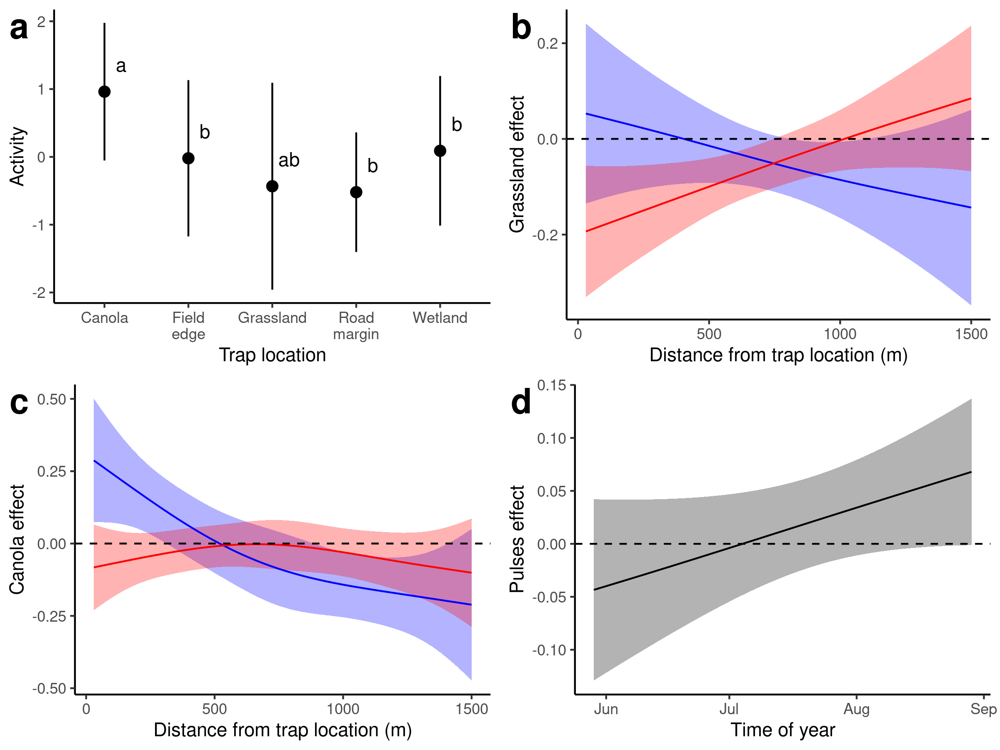

```{r setup, include=FALSE}
knitr::opts_chunk$set(echo = TRUE)
library(knitr)
```

# Introduction

* Arthropod diversity is important to understand in agricultural systems
  + Pests can cause large amounts of damage
  + Beneficial insects can offset this
  + Important for global biodiversity - insects may be declining globally
  + Agriculture is ~36% of land worldwide
  + Potential for win-win scenarios
  
* We don't have a good understanding of what drives beneficial arthropod abundance
  + Bees are generally driven by flower/nest substrate availability [@roulston2011]
  + Limited understanding of other arthropods
  + Beetles are limited by water, food, and oviposition sites [@lovei1996]
  + Arachnids are similarly limited by food, shelter
  
* Landscape structure can influence abundance of beneficial arthropods in agricultural areas [@albrecht2010]
  + No-till agriculture is better for some ground beetles [@busch_Msc]
  + How can we design landscapes to benefit both farmers and insects?
  
* Point estimates of abundance are influenced by spatio-temporal processes 
  + Arthropods move between landscape components depending on their life history
  + e.g. Carabid beetles are thought to reproduce in field margins, but adults feed in fields [@desender1988]
  + Counts in pitfall traps are a proxy of activity density (not actual density), but this is probably an OK measure, at least within fields [@lang2000]
* In this study, we used pitfall trap counts of three species of beneficial arthropod to determine how landscape composition affects activity density of arthropods
  + We hypothesized that:
  1. Abundance of semi-natural land (SNL) would result in increased arthropod abundance
  2. Nearby SNL acts as a source of arthropods earlier in the season, and act as a sink later on, as arthropods migrate into margins to reproduce

# Methods

## Data collection

* We used a system of pitfall traps installed in ditches, field margins, wetlands, and in-field sites across southern Alberta in 2017 (_need a map here_)
  + Traps at in-field sites were installed 20, 100, 200m (?) along a transect from the nearest non-crop feature (wetland, grassland, pivot)
  + Specimens were collected from the traps every 14 days, on average (SD: 2.9), and were identified to species
  
* To characterize landscape composition surrounding the traps, we used classified landscape data from AAFC
  + Classifications are very accurate for fields (~90%), but less accurate for non-crop areas (~70%, [@AAFC_data])
  + Landscape studies often use the landscape composition within a circle of a fixed radius surrounding each point
  + However, the radius of the circle depends on the grain of the landscape that is relevant to the abundance of a given organism.
  + Instead, we divided the landscape into annuli (rings) surrounding each trap location.
  + Each annulus was 30 m thick, and had inner radii ranging from 30 to 1470m, in increments of 30m.
  + Using functional regression (see below), we were able to incorporate landscape information at different distance, allowing us to assess the impact of both local and regional landscape composition 
  
## Statistics

* Function-on-scalar (FOS) regression is a special type of linear model ($\hat{y}=X\beta$), where the values of the coefficients ($\beta$) are defined by a smooth function
  + In our case, the coefficients represent the effect of a given type of landscape cover, and are a smooth function of distance from the trap (i.e. $\beta_i = f(distance_i)$)
  + This technique has been used by other authors; @galpern2020 called this ``onion-skin regression"
  + We fit our functional regression models using _mgcv_ version 1.8-31.
  + @ockinger2007 is a test

# Results

## _Pterostichus melanarius_ 



## _Pardosa distincta_ 


## _Phalangium opilio_ 


# Discussion

# References
